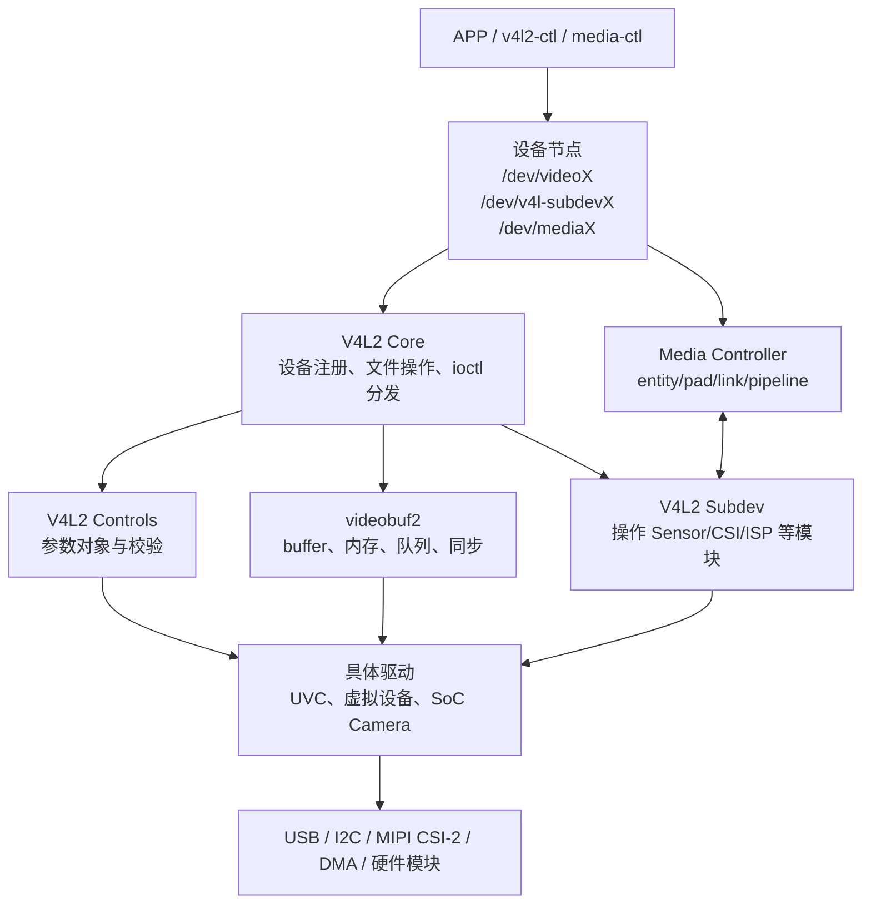
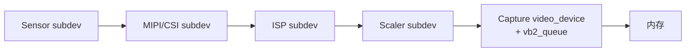

# V4L2 学习路线与全景图

## 1. 先给 V4L2 一个准确定位

V4L2（Video4Linux2）不是“某一种摄像头的驱动”，也不只是若干 `ioctl`。

它是一套 Linux 媒体设备接口和内核框架，解决四类问题：

1. 向用户空间提供统一设备节点和 ioctl ABI。
2. 描述设备支持的格式、分辨率、帧率、输入源和控制参数。
3. 管理持续流式传输所需的 buffer。
4. 对复杂媒体硬件描述内部模块及其连接关系。

理解 V4L2 最重要的一步，是把它拆成三条相互配合但职责不同的“面”：

| 视角 | 主要问题 | 核心框架 |
| --- | --- | --- |
| 控制面 | 设备能做什么？采用什么格式？曝光和亮度是多少？ | V4L2 Core、ioctl、controls、subdev ops |
| 数据面 | 一帧放在哪里？谁拥有 buffer？什么时候完成？ | videobuf2、DMA/URB、poll、QBUF/DQBUF |
| 拓扑面 | Sensor、CSI、ISP、Scaler、Capture 怎样连接？ | Media Controller、entity、pad、link、pipeline |

## 2. 总体分层



### 2.1 APP 负责什么

APP 不直接理解摄像头寄存器、USB 描述符或 DMA：

- 打开 `/dev/videoX`。
- 查询能力并选择格式。
- 申请、映射和排队 buffer。
- 启动/停止视频流。
- 等待完成帧，处理后归还 buffer。
- 使用 control ID 设置曝光、增益、亮度等参数。
- 对复杂设备，必要时用 `/dev/mediaX` 配置链路，用 `/dev/v4l-subdevX` 配置 pad 格式。

### 2.2 V4L2 Core 负责什么

V4L2 Core 是公共“接待层”：

- 注册并管理 `video_device`。
- 提供 V4L2 公共字符设备入口。
- 把用户 ioctl 校验、转换并分发给 `v4l2_ioctl_ops`。
- 提供优先级、文件句柄、事件和 controls 等公共设施。

它不懂某颗 Sensor 的寄存器，也不负责把 DMA 数据填入某个 buffer。

### 2.3 videobuf2 负责什么

videobuf2，简称 vb2，负责流式 I/O 的通用部分：

- buffer 数量、plane、大小和状态。
- MMAP、USERPTR、DMABUF 等内存模型。
- QBUF/DQBUF、等待队列和 poll。
- APP、vb2、驱动之间的 buffer 所有权交接。

驱动仍然要负责：

- 把可用 buffer 交给硬件。
- 编程 DMA、提交 URB 或产生虚拟图像。
- 在完成时填写长度、序号、时间戳。
- 调用 `vb2_buffer_done()`。

### 2.4 subdev 与 Media Controller 负责什么

复杂 SoC 摄像头通常不是一个硬件块：

```text
Sensor → MIPI D-PHY/CSI-2 → CSI Receiver → ISP → Scaler → Capture/DMA
```

- `v4l2_subdev` 把每个模块抽象成“可被操作的子设备”。
- Media Controller 把每个模块抽象成 entity，用 pad 和 link 描述连接。

一句话记忆：

> subdev 管“怎么操作这个模块”，Media Controller 管“这个模块和谁连接”。

## 3. 两类典型设备

### 3.1 整体式设备

典型例子：

- 虚拟摄像头。
- 简单 PCI/USB capture 设备。
- 从 V4L2 使用者角度看被 UVC 驱动封装成整体的 USB 摄像头。

它们常用一个 `video_device` 和一个 `vb2_queue` 就能完成主要工作：

```text
APP ↔ /dev/videoX ↔ V4L2 Core ↔ 具体驱动 ↔ 硬件
                              ↕
                             vb2
```

UVC 摄像头内部也有 Terminal 和 Unit，但协议标准化程度高，Linux UVC 驱动可以把它整体封装。APP 通常不需要先搭建一条 SoC media pipeline。

### 3.2 Pipeline 设备

MIPI 摄像头在 SoC 内部经过多个相对独立的硬件模块。不同 Sensor、CSI、ISP 和输出节点可能形成多条路线。



这里需要同时使用：

- subdev ops：上电、设置 mbus format、启动数据流。
- Media Controller：描述和选择 link。
- capture video node：向 APP 交付内存中的帧。
- vb2：管理 DMA buffer。

## 4. 三条关键路径

### 4.1 控制路径

```text
APP ioctl
  → VFS
  → V4L2 公共字符设备入口
  → video_device 的 fops / video_ioctl2
  → v4l2_ioctl_ops 或 controls
  → 主驱动 / subdev
  → USB control transfer、I2C 或寄存器
```

### 4.2 数据路径

```text
硬件产生一帧
  → DMA/URB/驱动线程填充驱动持有的 buffer
  → 驱动设置 payload、sequence、timestamp
  → vb2_buffer_done()
  → vb2 将 buffer 放入完成队列并唤醒 APP
  → APP VIDIOC_DQBUF
  → APP 处理
  → APP VIDIOC_QBUF 再次交给驱动
```

### 4.3 拓扑路径

```text
设备树 graph endpoint / 板级连接
  → 各驱动注册 subdev 和 media entity
  → async notifier 完成异步绑定
  → 聚合驱动创建 media links
  → APP 查看或配置拓扑
  → pipeline 校验
  → 各模块按顺序启动
```

## 5. 容易混淆的对象

| 对象 | 表示什么 | 是否直接生成设备节点 |
| --- | --- | --- |
| `struct v4l2_device` | 一组 V4L2 对象的实例级容器，管理 subdev | 否 |
| `struct video_device` | 一个 V4L2 视频/广播/VBI 节点 | 通常生成 `/dev/videoX` 等 |
| `struct vb2_queue` | 某种 buffer type 的流式队列 | 否，通常挂到 `video_device` |
| `struct v4l2_subdev` | Sensor、CSI、ISP 等子模块的操作接口 | 设置标志后可生成 `/dev/v4l-subdevX` |
| `struct media_device` | 一个 media graph 的总容器 | 生成 `/dev/mediaX` |
| `struct media_entity` | graph 中的一个功能块 | 本身不等于字符设备节点 |

## 6. 推荐学习顺序

1. 先写/读一个 MMAP 采集 APP，知道每个 ioctl 的目的。
2. 沿 `VIDIOC_S_FMT` 理解 V4L2 Core 的 ioctl 分发。
3. 沿 `REQBUFS/QBUF/DQBUF` 理解 vb2。
4. 写一个虚拟摄像头，建立“Core 提供什么、驱动实现什么”的边界。
5. 分析 UVC 的 URB 完成路径，看到真实数据如何进入 vb2。
6. 再学习 subdev 和 Media Controller。
7. 最后分析 MIPI pipeline 的注册、格式传播和 streamon。

后续阅读：

- [APP 接口与采集流程](01-APP接口与采集流程.md)
- [V4L2 Core 设备模型与 ioctl 调用链](02-V4L2-Core设备模型与ioctl调用链.md)
- [videobuf2 缓冲区管理](03-videobuf2缓冲区管理.md)
