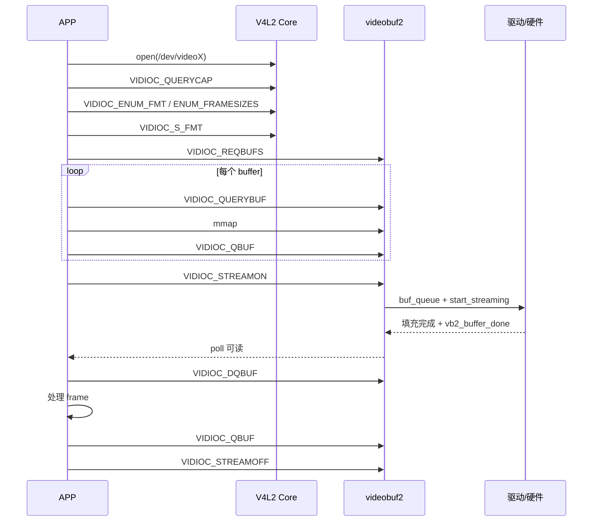
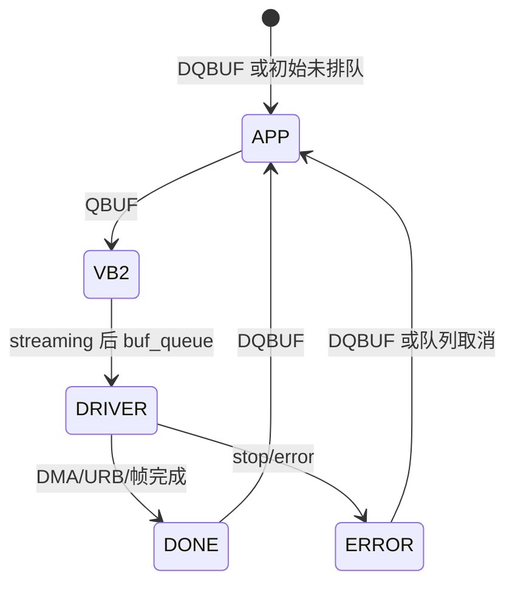

# APP 接口与采集流程

## 1. APP 看到的三个入口

### `/dev/videoX`

用于真正的视频 capture/output：

- 枚举和设置像素格式、分辨率、帧率。
- 管理 buffer。
- 启动、停止数据流。
- 设置 controls。

对简单 UVC 摄像头，APP 往往只需操作这个节点。

### `/dev/v4l-subdevX`

用于直接操作某个子模块，常见于复杂 SoC pipeline：

- 获取/设置某个 pad 的 media bus format。
- crop/compose selection。
- frame interval。
- 私有或标准 subdev ioctl。

普通采集 APP 不应仅凭编号猜测哪个节点是 Sensor，应从 media topology 查找 entity 与设备节点的对应关系。

### `/dev/mediaX`

用于查看和配置媒体拓扑：

- 枚举 entity、pad、link。
- 启用或禁用可配置 link。
- 获取完整 topology。

它本身不承载视频帧。

## 2. 一次典型 MMAP 采集



### 2.1 `open`

```c
fd = open("/dev/video0", O_RDWR | O_NONBLOCK);
```

`open` 建立一次文件上下文。驱动可能在第一次打开时：

- 上电或获取 runtime PM。
- 初始化 per-file `v4l2_fh`。
- 约束独占 streaming owner。

打开节点不等于已经启动 Sensor 或 DMA。

### 2.2 `VIDIOC_QUERYCAP`

先判断设备类型和 I/O 能力：

```c
struct v4l2_capability cap = {0};
ioctl(fd, VIDIOC_QUERYCAP, &cap);
```

Linux 4.9 中应注意 `V4L2_CAP_DEVICE_CAPS`：如果该位存在，应主要检查 `cap.device_caps`，否则检查 `cap.capabilities`。

常见能力：

- `V4L2_CAP_VIDEO_CAPTURE`
- `V4L2_CAP_VIDEO_CAPTURE_MPLANE`
- `V4L2_CAP_STREAMING`
- `V4L2_CAP_READWRITE`

### 2.3 枚举能力

```text
VIDIOC_ENUM_FMT          枚举像素格式
VIDIOC_ENUM_FRAMESIZES   枚举指定格式的分辨率
VIDIOC_ENUM_FRAMEINTERVALS 枚举格式+分辨率支持的帧间隔
VIDIOC_QUERYCTRL         查询 control
VIDIOC_QUERYMENU         查询菜单项
```

枚举直到 ioctl 返回 `EINVAL`，通常表示 index 已越界。

### 2.4 `TRY_FMT` 与 `S_FMT`

- `VIDIOC_TRY_FMT`：试算驱动会接受什么，不改变当前状态。
- `VIDIOC_S_FMT`：设置当前格式，驱动可修正宽高、stride、sizeimage。
- `VIDIOC_G_FMT`：读回实际格式。

```c
struct v4l2_format fmt = {0};
fmt.type = V4L2_BUF_TYPE_VIDEO_CAPTURE;
fmt.fmt.pix.width = 640;
fmt.fmt.pix.height = 480;
fmt.fmt.pix.pixelformat = V4L2_PIX_FMT_YUYV;
fmt.fmt.pix.field = V4L2_FIELD_NONE;

if (ioctl(fd, VIDIOC_S_FMT, &fmt) < 0)
    /* error */;

/* 后续必须使用驱动返回的 fmt，而非原始请求值 */
```

通常不允许在 queue busy 或 streaming 时修改格式。

### 2.5 `REQBUFS`

```c
struct v4l2_requestbuffers req = {
    .count = 4,
    .type = V4L2_BUF_TYPE_VIDEO_CAPTURE,
    .memory = V4L2_MEMORY_MMAP,
};
ioctl(fd, VIDIOC_REQBUFS, &req);
```

`count` 是请求值，实际数量以返回的 `req.count` 为准。

对 MMAP，通常由 vb2 的内存后端分配真正存图像的内存。`REQBUFS(count=0)` 常用于释放队列中的 buffer。

### 2.6 `QUERYBUF + mmap`

```c
struct v4l2_buffer buf = {0};
buf.type = req.type;
buf.memory = req.memory;
buf.index = i;
ioctl(fd, VIDIOC_QUERYBUF, &buf);

addr = mmap(NULL, buf.length, PROT_READ | PROT_WRITE,
            MAP_SHARED, fd, buf.m.offset);
```

`mmap` 让用户空间与内核/驱动访问同一块已分配内存，减少一次显式 `copy_to_user()`。这不保证整条链路绝对零拷贝：USB 解包、格式转换、ISP 或硬件限制仍可能产生复制。

### 2.7 `QBUF`

`VIDIOC_QBUF` 的本质是所有权交接：

```text
APP 拥有并可处理
    │ QBUF
    ▼
vb2/驱动拥有，APP 不应修改
```

在 streamon 之前排队的 buffer 会先进入 vb2 队列；streamon 后，vb2 再通过 `vb2_ops.buf_queue` 交给具体驱动。

### 2.8 `STREAMON`

```c
enum v4l2_buf_type type = V4L2_BUF_TYPE_VIDEO_CAPTURE;
ioctl(fd, VIDIOC_STREAMON, &type);
```

通常要求已经排入足够 buffer。vb2 会把排队的 buffer 交给驱动并调用 `start_streaming`。具体驱动才会真正：

- 提交 USB URB。
- 启动 Sensor/CSI/ISP。
- 配置并启动 DMA。
- 启动虚拟帧定时器或内核线程。

### 2.9 `poll + DQBUF`

```c
struct pollfd pfd = { .fd = fd, .events = POLLIN };
if (poll(&pfd, 1, 1000) > 0) {
    struct v4l2_buffer b = {
        .type = V4L2_BUF_TYPE_VIDEO_CAPTURE,
        .memory = V4L2_MEMORY_MMAP,
    };
    if (ioctl(fd, VIDIOC_DQBUF, &b) == 0) {
        consume(mapped[b.index], b.bytesused);
        ioctl(fd, VIDIOC_QBUF, &b);
    }
}
```

重要字段：

- `index`：哪块 buffer。
- `bytesused`：有效数据长度，不一定等于分配长度。
- `sequence`：帧序号。
- `timestamp`：采集相关时间戳。
- `flags`：错误、关键帧、时间戳类型等。

非阻塞 fd 在没有完成 buffer 时，`DQBUF` 返回 `EAGAIN`。

### 2.10 `STREAMOFF`

`VIDIOC_STREAMOFF` 不只是关硬件。驱动必须停止数据源，并把所有仍由驱动持有的 buffer 以 DONE 或 ERROR 状态归还 vb2，不能让 APP 永久等不到它们。

## 3. buffer 所有权循环



最实用的判断：

- QBUF 后，APP 暂时失去 buffer。
- DQBUF 后，APP重新获得 buffer。
- APP 如果不重新 QBUF，可供硬件使用的 buffer 会越来越少。

## 4. 四种 I/O 模型

| 模型 | 内存来源 | 典型用途 |
| --- | --- | --- |
| read/write | 驱动内部队列，read 时复制 | 简单、低帧率或兼容路径 |
| MMAP | 驱动/vb2 分配，映射给 APP | 最常见的采集方式 |
| USERPTR | APP 分配并在 QBUF 时传地址 | 老式共享方案，驱动支持度不一 |
| DMABUF | 外部 exporter 分配，通过 fd 共享 | 摄像头、GPU、编解码、显示之间共享 |

## 5. 单平面与多平面

“多平面”指 API 表达方式，不应简单等同于 YUV 有多个颜色分量。

### 单平面 API

- type：`V4L2_BUF_TYPE_VIDEO_CAPTURE`
- format：`fmt.fmt.pix`
- buffer 长度：`v4l2_buffer.length`

### 多平面 API

- type：`V4L2_BUF_TYPE_VIDEO_CAPTURE_MPLANE`
- format：`fmt.fmt.pix_mp`
- 每个 buffer 带 `struct v4l2_plane[]`
- 每个 plane 有独立 `length`、`bytesused`、offset/fd

APP 必须根据 capability 和 queue type 使用对应 API，不能混用。

## 6. Controls 与 format 不一样

- format 决定数据布局：宽、高、FourCC、stride、sizeimage。
- control 调整设备行为：曝光、增益、白平衡、亮度、翻转。

```c
struct v4l2_control c = {
    .id = V4L2_CID_BRIGHTNESS,
    .value = 128,
};
ioctl(fd, VIDIOC_S_CTRL, &c);
```

复杂和批量 control 更适合 `VIDIOC_G_EXT_CTRLS` / `VIDIOC_S_EXT_CTRLS`。

## 7. 对照本仓库实验

可结合 [`../v4l2_camera_view/README.md`](../v4l2_camera_view/README.md) 和 `main.c` 阅读：

```text
open camera
→ query/set format
→ reqbufs/querybuf/mmap
→ qbuf all
→ streamon
→ poll/dqbuf
→ YUYV 转 RGB
→ 写 framebuffer
→ qbuf
```

下一篇：[V4L2 Core 设备模型与 ioctl 调用链](02-V4L2-Core设备模型与ioctl调用链.md)。
