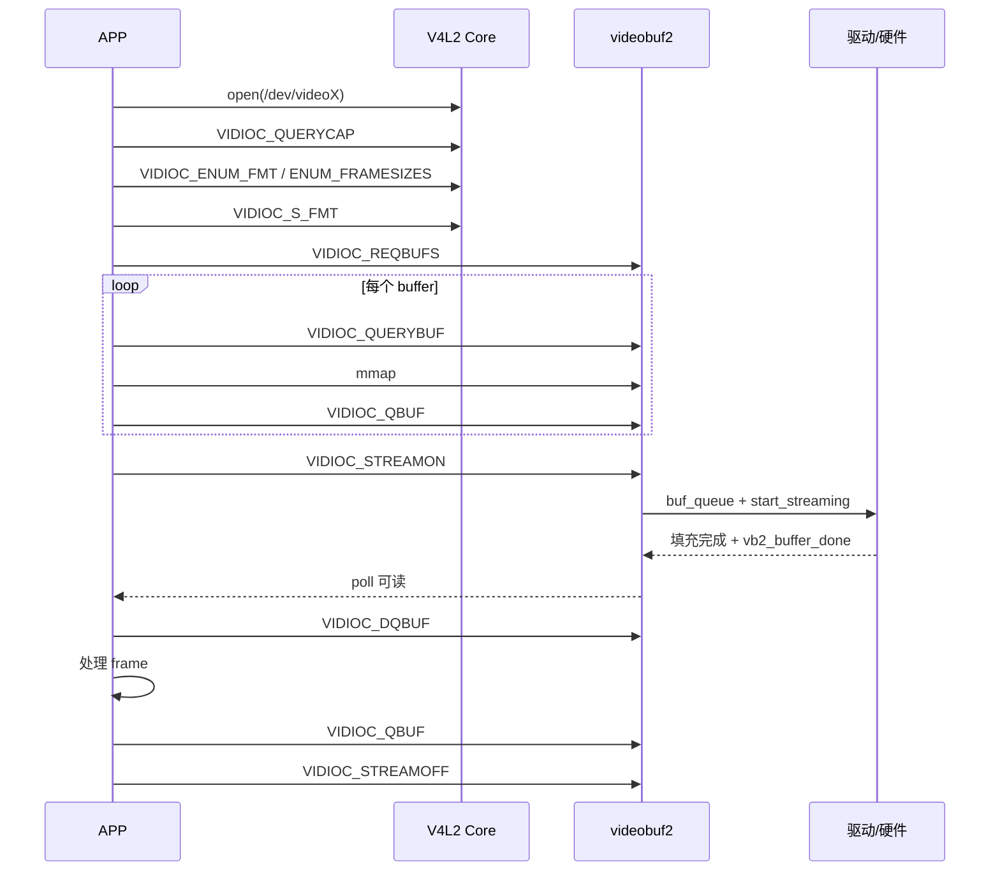
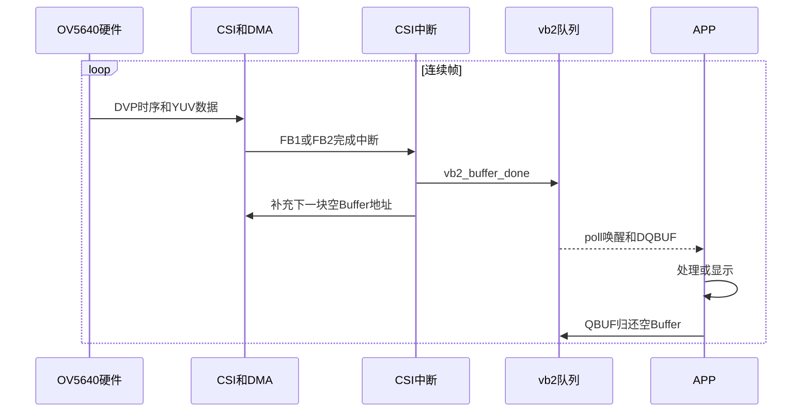
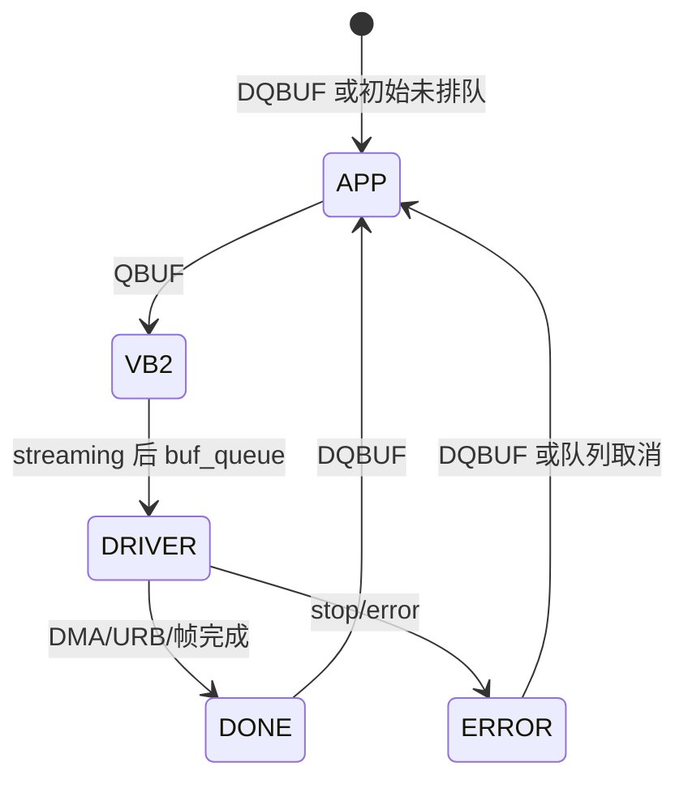

# APP 接口与采集流程

## 1. APP 看到的三个入口

### `/dev/videoX`

用于真正的视频 capture/output：

- 枚举和设置像素格式、分辨率、帧率。
- 管理 buffer。
- 启动、停止数据流。
- 设置 controls。

对简单 UVC 摄像头，APP 往往只需操作这个节点。

### `/dev/v4l-subdevX`

暂时没关注,  这个应该是控制节点？

### `/dev/mediaX`

暂时没关注

## 2. 采集流程



### 2.1 `open`

```c
fd = open("/dev/video0", O_RDWR | O_NONBLOCK);
```

`open` 建立一次文件上下文。驱动可能在第一次打开时：

- 上电或获取 runtime PM。
- 初始化 per-file `v4l2_fh`。
- 约束独占 streaming owner。

打开节点不等于已经启动 Sensor 或 DMA。

### 2.2 `VIDIOC_QUERYCAP`

判断设备类型和 I/O 能力：

```c
struct v4l2_capability cap = {0};
ioctl(fd, VIDIOC_QUERYCAP, &cap);
```

常见能力：

- `V4L2_CAP_VIDEO_CAPTURE`
- `V4L2_CAP_VIDEO_CAPTURE_MPLANE`
- `V4L2_CAP_STREAMING`
- `V4L2_CAP_READWRITE`

### 2.3 枚举能力

```text
VIDIOC_ENUM_FMT          枚举像素格式
VIDIOC_ENUM_FRAMESIZES   枚举指定格式的分辨率
```

### 2.4 `TRY_FMT` 与 `S_FMT`

- `VIDIOC_TRY_FMT`：试算驱动会接受什么，不改变当前状态。
- `VIDIOC_S_FMT`：设置当前格式，驱动可修正宽高、stride、sizeimage。
- `VIDIOC_G_FMT`：读回实际格式。

```c
struct v4l2_format fmt = {0};
fmt.type = V4L2_BUF_TYPE_VIDEO_CAPTURE;
fmt.fmt.pix.width = 640;
fmt.fmt.pix.height = 480;
fmt.fmt.pix.pixelformat = V4L2_PIX_FMT_YUYV;

if (ioctl(fd, VIDIOC_S_FMT, &fmt) < 0)
    /* error */;

/* 后续必须使用驱动返回的 fmt，而非原始请求值 */
```

### 2.5 `VIDIOC_REQBUFS`：建立Buffer池

先记一句话：

> `REQBUFS`负责建立“轮流装图像的空桶池”，但它既不启动Sensor，也不开始采集。

```c
struct v4l2_requestbuffers req = {
    .count = 4,
    .type = V4L2_BUF_TYPE_VIDEO_CAPTURE,
    .memory = V4L2_MEMORY_MMAP,
};
ioctl(fd, VIDIOC_REQBUFS, &req);
```

三个参数分别表示：

| 参数 | 作用 |
|---|---|
| `type` | 选择采集队列还是输出队列 |
| `memory` | 选择MMAP、USERPTR或DMABUF等内存模型 |
| `count` | 希望建立多少块可轮换的Buffer |

当前i.MX6ULL驱动的调用链是：

```text
VIDIOC_REQBUFS
  → mx6s_vidioc_reqbufs()
  → vb2_reqbufs()
  → mx6s_videobuf_setup()
  → 根据pix.sizeimage确定每块Buffer大小
  → vb2_dma_contig_memops准备DMA连续内存
```

源码对应：

```c
q->mem_ops = &vb2_dma_contig_memops;
sizes[0] = csi_dev->pix.sizeimage;
```

执行完后，Buffer已经创建，但还没有交给CSI：

```text
Buffer 0～3：已创建，状态为“尚未排队”
```

它没有使能OV5640、CSI和DMA，也没有产生图像。

`count`只是请求值，实际数量以返回的`req.count`为准。Buffer数量用于吸收APP处理抖动：

```text
内存占用 = req.count × sizeimage
```

它不是由帧率直接决定。当前`mx6s_start_streaming()`至少要求2块已排队Buffer，因为CSI使用FB1、FB2两个DMA地址做乒乓采集。4块是内存、延迟和抗抖动之间的常见折中。

`REQBUFS(count = 0)`通常用来释放Buffer池。

---

### 2.6 `VIDIOC_QUERYBUF + mmap`：取得Buffer说明和APP访问地址

`QUERYBUF`查询某个index对应Buffer的长度和MMAP偏移：

```c
struct v4l2_buffer buf = {0};
buf.type = req.type;
buf.memory = req.memory;
buf.index = i;
ioctl(fd, VIDIOC_QUERYBUF, &buf);
```

重要字段：

| 字段 | 含义 |
|---|---|
| `index` | 第几块Buffer |
| `length` | 可映射长度 |
| `m.offset` | 传给`mmap()`的队列偏移标识 |

```c
addr = mmap(NULL, buf.length, PROT_READ | PROT_WRITE,
            MAP_SHARED, fd, buf.m.offset);
```

`mmap`不是复制或重新申请一份图像，而是让APP映射同一块底层内存：

```text
APP用户虚拟地址
       ↕ mmap
同一块底层内存
       ↕ DMA地址
CSI硬件
```

CSI DMA写完后，APP可直接读取映射地址，不需要驱动再`copy_to_user()`。用户虚拟地址、内核虚拟地址和DMA地址数值可能不同，但指向同一块存储。

---

### 2.7 `VIDIOC_QBUF`：把空Buffer交给采集系统

> `QBUF`不是取图像，而是告诉驱动：“这块Buffer是空的，可以装下一帧。”

```text
QBUF前：APP拥有，可以读写
  ↓ VIDIOC_QBUF
QBUF后：vb2/驱动拥有，APP不得修改
```

当前调用链：

```text
mx6s_vidioc_qbuf()
  → vb2_qbuf()
  → Buffer进入QUEUED状态
```

在`STREAMON`之前QBUF时，Buffer先在vb2中等待。开始streaming后，vb2调用：

```c
mx6s_videobuf_queue()
```

把它加入`csi_dev->capture`链表。这个链表就是“等待交给CSI DMA的空Buffer队列”。

必须先QBUF再STREAMON，因为CSI启动前必须先有接收图像的内存。

---

### 2.8 `STREAMON`：启动Sensor和CSI接收端

```c
enum v4l2_buf_type type = V4L2_BUF_TYPE_VIDEO_CAPTURE;
ioctl(fd, VIDIOC_STREAMON, &type);
```

当前BSP的真实顺序是：

```text
mx6s_vidioc_streamon()
  → v4l2_subdev_call(sd, video, s_stream, 1)
  → ov5640_s_stream(1)
  → ov5640_start()
  → 写0x3008 = 0x02，Sensor退出待机并连续输出DVP
  → vb2_streamon()
  → 已QBUF的Buffer进入mx6s_videobuf_queue()
  → mx6s_start_streaming()
  → 前两块DMA地址写入CSI_CSIDMASA_FB1/FB2
  → 使能CSI DMA请求、帧完成中断和CSI
```

这里有两个不同的启动：

| 对象 | 启动内容 |
|---|---|
| `ov5640_s_stream(1)` | Sensor开始产生PCLK、VSYNC、HREF和D0～D7 |
| `mx6s_start_streaming()` | CSI接收DVP并通过DMA写入内存 |

FB1、FB2是硬件乒乓Buffer：硬件写FB1时准备FB2，FB1完成后切换FB2，并给FB1位置换上下一块空Buffer。

---

### 2.9 `poll + DQBUF + QBUF`：APP的帧循环

```c
while (running) {
    poll(&pfd, 1, 1000);
    ioctl(fd, VIDIOC_DQBUF, &buf);

    consume(mapped[buf.index], buf.bytesused);

    ioctl(fd, VIDIOC_QBUF, &buf);
}
```

| 操作 | 作用 |
|---|---|
| `poll()` | 等待至少有一块完成Buffer |
| `DQBUF` | 取回完成Buffer的所有权 |
| `QBUF` | 处理完后归还空Buffer |

CSI一帧完成时，驱动在中断处理中调用：

```c
vb2_buffer_done(vb, VB2_BUF_STATE_DONE);
```

vb2把Buffer放进完成队列并唤醒`poll()`或阻塞的`DQBUF`。`DQBUF`返回后APP才重新拥有Buffer。

重要字段：

- `index`：读取`mapped[index]`。
- `bytesused`：有效数据长度。
- `sequence`：帧序号，可辅助判断丢帧。
- `timestamp`：采集时间戳。
- `flags`：错误和时间戳属性等。

如果APP只DQBUF而不重新QBUF，可供CSI使用的空Buffer会越来越少。

---

### 2.10 `STREAMOFF`：停止两端并收回Buffer

当前BSP的顺序是：

```text
VIDIOC_STREAMOFF
  → vb2_streamoff()
  → mx6s_stop_streaming()
  → 关闭CSI DMA请求、中断和CSI
  → 以ERROR状态归还未完成Buffer
  → ov5640_s_stream(0)
  → ov5640_stop()
  → 写0x3008 = 0x42
```

所以`STREAMOFF`不只是退出APP循环，还必须停止硬件、解除DMA占用并归还所有Buffer。

---

### 2.11 连续采集的循环到底在哪里

答案不是一个循环，而是三个同时工作的循环。

#### 第一层：OV5640内部硬件帧循环

```text
XCLK/PLL
  → 内部时序发生器
  → 曝光、逐行读出、ISP生成YUV
  → 输出VSYNC/HREF/PCLK/D0～D7
  → 自动进入下一帧
```

`ov5640_start()`只写寄存器让Sensor退出待机。之后逐帧曝光和DVP输出由OV5640内部硬件状态机自动完成，因此驱动里没有：

```c
while (1)
    output_one_frame();
```

#### 第二层：CSI DMA乒乓循环和中断

```text
第1帧 → DMA写FB1 → FB1完成中断
第2帧 → DMA写FB2 → FB2完成中断
第3帧 → DMA写更新后的FB1 → 继续
```

中断入口是：

```c
mx6s_csi_irq_handler()
```

它检查`BIT_DMA_TSF_DONE_FB1/FB2`并调用：

```c
mx6s_csi_frame_done()
```

这个函数：

1. 对刚完成的Buffer调用`vb2_buffer_done()`，交给APP。
2. 从`csi_dev->capture`取下一块QBUF回来的空Buffer。
3. 把新DMA地址写入刚空出的FB1或FB2寄存器。

中断不产生图像。Sensor产生图像，CSI DMA搬运图像；中断只负责一帧完成后的Buffer交接和地址补充。

#### 第三层：APP回收Buffer的循环

```text
poll/DQBUF取得满Buffer
  → 处理、显示或交给PXP
  → QBUF归还空Buffer
  → 再等待下一块满Buffer
```

APP不是命令Sensor“再拍一帧”。Sensor一直按照设定帧率输出，APP只负责循环使用Buffer。

如果APP太慢，`capture`空队列会耗尽。当前`mx6s_capture.c`会改用`discard_buffer`继续接收并丢弃图像，因此表现为掉帧，而不是Sensor停止。



PXP加入后不替代Sensor循环。APP从Camera DQBUF得到一帧，再把它提交给PXP；PXP完成一次YUV到RGB任务后也通过中断/回调通知完成。
> **当前OV5640 V3驱动特例：** `init_device()`中也调用了`ov5640_start()`。这意味着Sensor可能在初始化阶段就退出待机。后续`VIDIOC_STREAMON`仍会再次调用`s_stream(1)`；而CSI的DMA Buffer、FB1/FB2地址和中断是在`mx6s_start_streaming()`中才真正准备好。学习时要把“Sensor正在输出”和“CSI正在把数据采进用户Buffer”区分开。

### 2.12 当前源码导航

以下行号对应当前Linux 4.9.88源码，后续修改代码后可能略有变化：

| 作用 | 文件与函数 | 当前起始行 |
|---|---|---:|
| REQBUFS入口 | `mx6s_capture.c: mx6s_vidioc_reqbufs()` | 1519 |
| QBUF入口 | `mx6s_capture.c: mx6s_vidioc_qbuf()` | 1548 |
| DQBUF入口 | `mx6s_capture.c: mx6s_vidioc_dqbuf()` | 1558 |
| STREAMON总入口 | `mx6s_capture.c: mx6s_vidioc_streamon()` | 1699 |
| vb2回调表 | `mx6s_capture.c: mx6s_videobuf_ops` | 1189 |
| CSI启动和FB1/FB2配置 | `mx6s_capture.c: mx6s_start_streaming()` | 1086 |
| 一帧完成处理 | `mx6s_capture.c: mx6s_csi_frame_done()` | 1199 |
| CSI中断入口 | `mx6s_capture.c: mx6s_csi_irq_handler()` | 1285 |
| Sensor的s_stream | `ov5640_v3.c: ov5640_s_stream()` | 1226 |
| Sensor退出待机 | `ov5640_v3.c: ov5640_start()` | 1005 |
| Sensor进入待机 | `ov5640_v3.c: ov5640_stop()` | 1059 |

建议实际阅读顺序：

```text
mx6s_vidioc_streamon
  → ov5640_s_stream
  → ov5640_start
  → vb2_streamon
  → mx6s_videobuf_queue
  → mx6s_start_streaming
  → mx6s_csi_irq_handler
  → mx6s_csi_frame_done
  → vb2_buffer_done
```

## 3. buffer 所有权循环



最实用的判断：

- QBUF 后，APP 暂时失去 buffer。
- DQBUF 后，APP重新获得 buffer。
- APP 如果不重新 QBUF，可供硬件使用的 buffer 会越来越少。

## 4. 单平面与多平面

“多平面”指 API 表达方式，不应简单等同于 YUV 有多个颜色分量。

### 单平面 API

- type：`V4L2_BUF_TYPE_VIDEO_CAPTURE`
- format：`fmt.fmt.pix`
- buffer 长度：`v4l2_buffer.length`

### 多平面 API

- type：`V4L2_BUF_TYPE_VIDEO_CAPTURE_MPLANE`
- format：`fmt.fmt.pix_mp`
- 每个 buffer 带 `struct v4l2_plane[]`
- 每个 plane 有独立 `length`、`bytesused`、offset/fd

APP 必须根据 capability 和 queue type 使用对应 API，不能混用。

## 5. controls 与 format 的区别

- format 决定数据布局：宽、高、FourCC、stride、sizeimage。
- control 调整设备行为：曝光、增益、白平衡、亮度、翻转。这部分因该是手机业务会大量用

```shel
struct v4l2_control c = {
    .id = V4L2_CID_BRIGHTNESS,
    .value = 128,
};
ioctl(fd, VIDIOC_S_CTRL, &c);
```

## 6. FQA
### 1. Buffer Count 的疑问

为什么视频中介绍的 buffer 申请数量是 4？ 应该跟 Audio 的buffer 一样要有一个采样率、bit 等等一个计算公式才合理？

