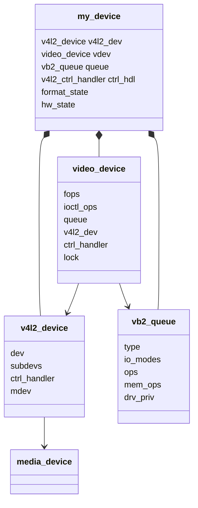
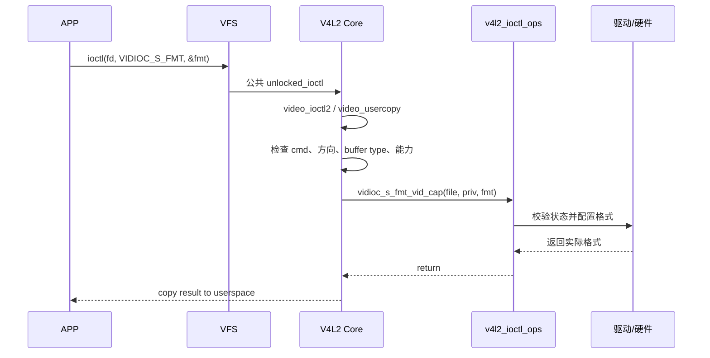

# V4L2 Core 设备模型与 ioctl 调用链

## 1. 从字符设备到 V4L2 设备

普通字符驱动通常直接注册自己的 `struct file_operations`。V4L2 在此之上增加公共层：

```text
VFS struct file_operations（V4L2 Core 的公共 v4l2_fops）
  → 根据 minor 找到 video_device
  → 调用 video_device->fops（struct v4l2_file_operations）
  → ioctl 通常进入 video_ioctl2()
  → 根据 cmd 调用 video_device->ioctl_ops
```

注意存在两种容易同名混淆的 fops：

- VFS 的 `struct file_operations`：V4L2 Core 内部公共入口。
- 驱动填写的 `struct v4l2_file_operations`：V4L2 驱动接口。

## 2. 核心对象



### 2.1 `struct v4l2_device`

它是一个 V4L2 设备实例的容器和协调者：

- 关联父 `struct device`。
- 维护已注册 subdev 链表。
- 可关联 control handler 和 `media_device`。
- 为多个 video node/subdev 提供共同归属。

`v4l2_device_register()` 本身不会创建 `/dev/videoX`。

### 2.2 `struct video_device`

它表示一个用户可打开的 V4L2 节点：

- 节点名称和类型。
- `v4l2_file_operations`。
- `v4l2_ioctl_ops`。
- `vb2_queue`。
- 锁、controls、优先级、release 回调。

`video_register_device()` 注册后，才会分配 minor 并形成 `/dev/videoX` 等节点。

一个物理设备可以有多个 `video_device`，例如：

- 主图像输出。
- 缩略图输出。
- metadata capture。
- 编码器输入/输出。

### 2.3 `struct v4l2_fh`

`v4l2_fh` 是一次 open 的上下文，常用于：

- 事件订阅和队列。
- controls per-file 状态。
- priority。
- 驱动自己的 per-file 私有数据。

它与 `video_device` 的关系类似“打开实例”与“设备节点定义”的关系。

## 3. 注册流程

典型简单设备：

```text
probe
  → 分配驱动私有对象
  → v4l2_device_register(parent, &dev->v4l2_dev)
  → 初始化 controls
  → 初始化 vb2_queue
  → 填写 video_device
       fops
       ioctl_ops
       queue
       v4l2_dev
       ctrl_handler
       lock
       release
  → video_set_drvdata()
  → video_register_device()
```

注销顺序通常反向：

```text
video_unregister_device()
→ v4l2_ctrl_handler_free()
→ v4l2_device_unregister()
→ 释放其他资源
```

`video_device.release` 是对象生命周期的一部分，不能随意为空。嵌入在私有对象中的 `video_device` 常见使用 `video_device_release_empty`，前提是私有对象由更外层明确释放。

## 4. open 调用链

概念化调用链：

```text
APP open("/dev/video0")
  → VFS
  → V4L2 Core 公共 v4l2_open()
  → 根据 minor 找 video_device
  → 增加 video_device 引用
  → vdev->fops->open(file)
  → 驱动 open 或 vb2_fop_open()
```

简单 vb2 驱动常直接使用：

```c
static const struct v4l2_file_operations my_fops = {
    .owner          = THIS_MODULE,
    .open           = v4l2_fh_open,
    .release        = vb2_fop_release,
    .read           = vb2_fop_read,
    .poll           = vb2_fop_poll,
    .mmap           = vb2_fop_mmap,
    .unlocked_ioctl = video_ioctl2,
};
```

是否能直接采用这些 helper，取决于驱动的锁、queue ownership 和 open/close 需求。

## 5. ioctl 调用链



### 5.1 `video_ioctl2`

驱动把 `.unlocked_ioctl = video_ioctl2` 后，可复用 V4L2 Core 的标准 ioctl 分发：

- 从用户空间复制参数。
- 根据 ioctl 元数据做公共检查。
- 记录和打印 ioctl。
- 根据 buffer type/capability 选择回调。
- 调用 `v4l2_ioctl_ops`。
- 把结果复制回用户空间。

驱动主要实现“设备语义”，而不是重复处理用户指针。

### 5.2 `v4l2_ioctl_ops`

常见 capture 回调：

```c
static const struct v4l2_ioctl_ops my_ioctl_ops = {
    .vidioc_querycap          = my_querycap,
    .vidioc_enum_fmt_vid_cap  = my_enum_fmt,
    .vidioc_g_fmt_vid_cap     = my_g_fmt,
    .vidioc_try_fmt_vid_cap   = my_try_fmt,
    .vidioc_s_fmt_vid_cap     = my_s_fmt,

    .vidioc_reqbufs           = vb2_ioctl_reqbufs,
    .vidioc_querybuf          = vb2_ioctl_querybuf,
    .vidioc_qbuf              = vb2_ioctl_qbuf,
    .vidioc_dqbuf             = vb2_ioctl_dqbuf,
    .vidioc_streamon          = vb2_ioctl_streamon,
    .vidioc_streamoff         = vb2_ioctl_streamoff,
};
```

格式类回调通常由驱动实现；buffer 类回调通常直接接入 vb2 helper。

## 6. `VIDIOC_S_FMT` 应做什么

典型流程：

1. 确认不是 streaming，queue 也不 busy。
2. 调用同一套 `try_fmt` 逻辑修正参数。
3. 把修正后的格式保存到设备实例。
4. 必要时配置或延迟配置硬件/subdev。
5. 返回实际值。

不要在 `enum_fmt` 中做硬件启动，也不要假设 APP 传入的格式一定合法。

## 7. buffer ioctl 怎样接入 vb2

以 QBUF 为例：

```text
APP VIDIOC_QBUF
  → video_ioctl2
  → v4l_qbuf 等公共包装
  → ioctl_ops->vidioc_qbuf
  → vb2_ioctl_qbuf
  → vb2_qbuf / vb2_core_qbuf
  → vb2_ops.buf_prepare
  → buffer 进入 vb2 queued 状态
  → streaming 时调用 vb2_ops.buf_queue
```

V4L2 Core 负责 ioctl ABI，vb2 负责队列状态，具体驱动的 `buf_queue` 负责把 buffer 加入硬件可消费的 active list。这三层不能混成一层。

## 8. poll 与 mmap

### poll

```text
APP poll
  → V4L2 公共 fops
  → 驱动 fops->poll（常为 vb2_fop_poll）
  → vb2_poll
  → 等待 done buffer / event
```

### mmap

```text
APP mmap
  → V4L2 公共 fops
  → 驱动 fops->mmap（常为 vb2_fop_mmap）
  → vb2_mmap
  → vb2_mem_ops.mmap
  → 内存后端建立 VMA 映射
```

## 9. 驱动私有数据怎样取回

注册时：

```c
video_set_drvdata(&dev->vdev, dev);
```

回调中：

```c
struct my_dev *dev = video_drvdata(file);
```

vb2 回调中：

```c
struct my_dev *dev = vb2_get_drv_priv(vq);
```

这让 ioctl 回调、fops 和 vb2 ops 都能回到同一个设备实例。

## 10. 锁的层次

常见做法：

- `video_device.lock` / `vb2_queue.lock`：串行化 ioctl 和 queue 操作，通常为 mutex。
- spinlock：保护中断上下文访问的 active buffer 链表。
- 硬件寄存器锁：按设备实际需要。

`wait_prepare` 和 `wait_finish` 用于 vb2 在阻塞等待时释放/重新获取驱动 mutex，避免 DQBUF 等待期间锁死生产者。

下一篇：[videobuf2 缓冲区管理](03-videobuf2缓冲区管理.md)。
