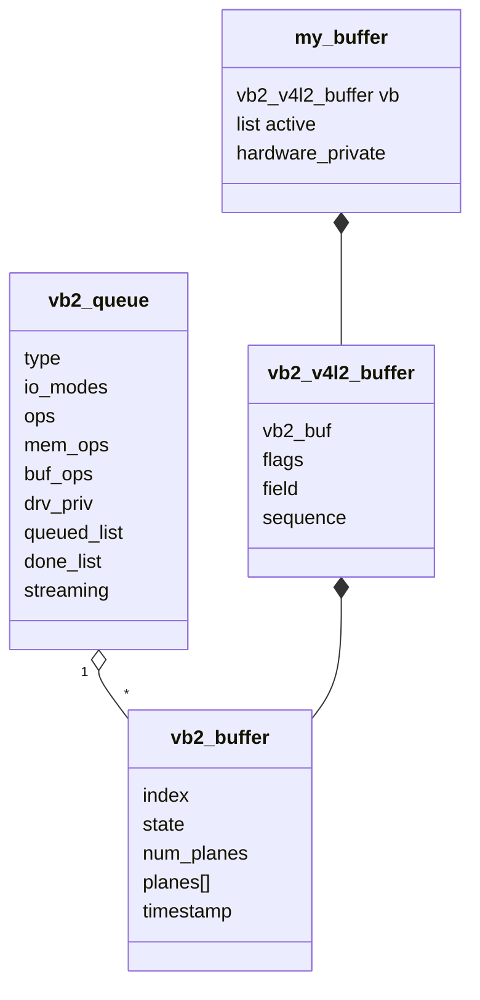
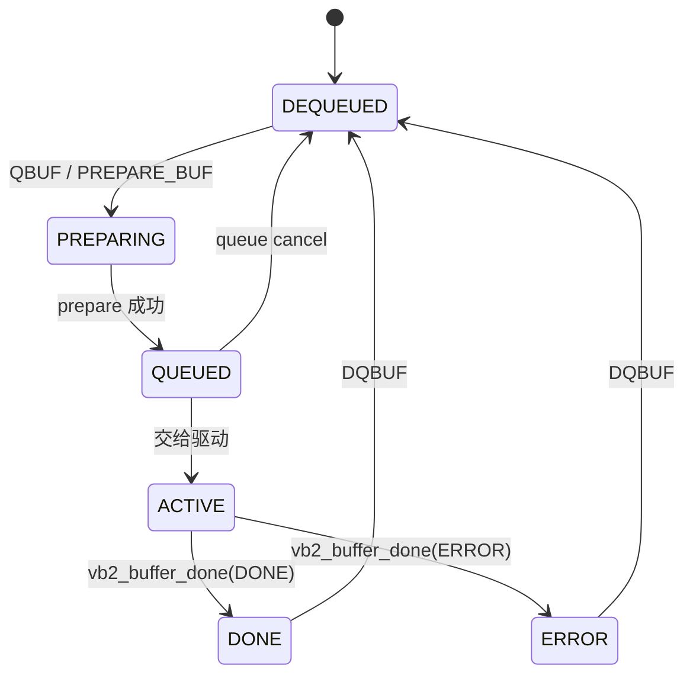

# videobuf2 缓冲区管理

## 1. vb2 到底解决什么

视频流和普通 `read()` 最大的区别是：帧持续产生、数据量大，而且 APP 与硬件必须反复交换一组 buffer。

videobuf2 把通用工作抽出来：

- buffer 的创建、销毁和状态检查。
- plane 大小和 payload。
- MMAP、USERPTR、DMABUF。
- QBUF、DQBUF、STREAMON、STREAMOFF。
- 阻塞等待、poll 和完成队列。

vb2 不负责解析 USB 包，不知道 Sensor 寄存器，也不自动编程 DMA。

## 2. 核心对象



### `vb2_queue`

代表一种 buffer type 的队列。capture 和 output、多种 stream 通常各有自己的 queue。

关键成员：

```c
q->type          /* VIDEO_CAPTURE 等 */
q->io_modes      /* VB2_MMAP | VB2_DMABUF ... */
q->ops           /* 驱动相关 queue 回调 */
q->mem_ops       /* 内存后端 */
q->drv_priv      /* 驱动私有对象 */
q->buf_struct_size
q->lock
q->dev
```

### `vb2_buffer`

表示 vb2 的通用 buffer：

- index 和状态。
- 一个或多个 plane。
- 每个 plane 的长度、payload 和内存私有对象。
- 所属 queue。

### `vb2_v4l2_buffer`

把 V4L2 语义添加到 `vb2_buffer`：

- `sequence`
- `field`
- V4L2 flags
- timecode 等

驱动常进一步扩展：

```c
struct my_buffer {
    struct vb2_v4l2_buffer vb;
    struct list_head active;
};
```

## 3. 三组 ops

### 3.1 `vb2_ops`：驱动与硬件相关

这是驱动作者主要实现的一组：

| 回调 | 用途 |
| --- | --- |
| `queue_setup` | 确定 buffer 数量、plane 数和每个 plane 大小 |
| `buf_init` | buffer 分配后做一次性私有初始化 |
| `buf_prepare` | 每次 QBUF 前检查大小、设置 payload |
| `buf_queue` | 把 buffer 交给驱动 active queue/硬件 |
| `start_streaming` | 启动数据源、DMA、URB |
| `stop_streaming` | 停硬件并归还所有未完成 buffer |
| `wait_prepare` | 阻塞等待前释放驱动锁 |
| `wait_finish` | 阻塞等待结束后重新加锁 |

### 3.2 `vb2_mem_ops`：内存后端

通常直接选择内核提供的实现：

- `vb2_vmalloc_memops`：虚拟连续，适合虚拟设备或 CPU 填充。
- `vb2_dma_contig_memops`：DMA 物理连续或通过 IOMMU 连续。
- `vb2_dma_sg_memops`：scatter-gather DMA。

它负责 alloc、mmap、USERPTR pin、DMABUF attach/map、cache 同步等。

驱动一般不自己实现整套 mem ops。

### 3.3 `vb2_buf_ops`：V4L2 与 vb2 表示转换

它处理用户的 `v4l2_buffer`/planes 与内核 `vb2_buffer` 之间的转换和验证。使用 V4L2 vb2 层初始化 queue 时，通常由框架设置，不是普通驱动的定制点。

## 4. buffer 状态机



不要把所有 buffer 简化成“空闲链表”和“完成链表”。真实层次至少包括：

1. vb2 自己的 queued 状态/链表。
2. 具体驱动的 active/irq queue。
3. vb2 的 done queue。

驱动私有 active list 很重要，因为硬件中断通常需要快速找到“当前 DMA 正在写哪个 buffer”。

## 5. `REQBUFS`

概念调用链：

```text
VIDIOC_REQBUFS
  → vb2_ioctl_reqbufs
  → vb2_reqbufs / vb2_core_reqbufs
  → vb2_ops.queue_setup
  → 为每个 buffer 分配驱动扩展对象
  → 为每个 plane 调用 vb2_mem_ops.alloc
  → 必要时再次 queue_setup 验证实际分配结果
```

`queue_setup` 示例：

```c
static int my_queue_setup(struct vb2_queue *vq,
                          const void *parg,
                          unsigned int *nbufs,
                          unsigned int *nplanes,
                          unsigned int sizes[],
                          void *alloc_ctxs[])
{
    struct my_dev *dev = vb2_get_drv_priv(vq);

    if (*nplanes) {
        if (sizes[0] < dev->sizeimage)
            return -EINVAL;
        return 0;
    }

    *nplanes = 1;
    sizes[0] = dev->sizeimage;
    if (*nbufs < 3)
        *nbufs = 3;
    return 0;
}
```

> Linux 不同 4.x 小版本和厂商树的 `queue_setup` 参数可能略有差异，编写时必须以目标 4.9 头文件为准。

## 6. `QBUF`

```text
VIDIOC_QBUF
  → vb2_ioctl_qbuf
  → 将用户 buffer 信息转换到 vb2
  → vb2_ops.buf_prepare
  → 状态变为 QUEUED
  → 若已经 streaming：
       内存 prepare/cache sync
       状态变为 ACTIVE
       vb2_ops.buf_queue
```

驱动 `buf_queue` 常做的事情：

```c
static void my_buf_queue(struct vb2_buffer *vb)
{
    struct my_dev *dev = vb2_get_drv_priv(vb->vb2_queue);
    struct my_buffer *buf =
        container_of(to_vb2_v4l2_buffer(vb),
                     struct my_buffer, vb);
    unsigned long flags;

    spin_lock_irqsave(&dev->qlock, flags);
    list_add_tail(&buf->active, &dev->active);
    spin_unlock_irqrestore(&dev->qlock, flags);

    /* 如果硬件空闲，可在这里启动下一次 DMA */
}
```

## 7. `STREAMON`

```text
VIDIOC_STREAMON
  → vb2_ioctl_streamon
  → 检查 queue 和 buffer 数量
  → 将已排队 buffer 逐个交给 vb2_ops.buf_queue
  → vb2_ops.start_streaming
```

如果 `start_streaming` 失败，驱动必须确保已交给自己的 buffer 被归还，或让 vb2 的失败路径能够安全收回。否则 queue 状态会损坏。

## 8. 硬件完成一帧

DMA 中断、URB complete 或虚拟定时器中：

```c
buf = my_get_current_buffer(dev);

vb2_set_plane_payload(&buf->vb.vb2_buf, 0, dev->sizeimage);
buf->vb.sequence = dev->sequence++;
buf->vb.field = V4L2_FIELD_NONE;
buf->vb.vb2_buf.timestamp = ktime_get_ns(); /* 依目标 4.9 API 调整 */

vb2_buffer_done(&buf->vb.vb2_buf, VB2_BUF_STATE_DONE);
```

完成后：

- vb2 将 buffer 加入 done queue。
- 唤醒阻塞的 DQBUF/poll。
- 驱动不再拥有该 buffer。

错误帧可使用 `VB2_BUF_STATE_ERROR`。

## 9. `DQBUF`

```text
VIDIOC_DQBUF
  → vb2_ioctl_dqbuf
  → 等待 done queue 非空
  → wait_prepare 释放 mutex
  → 被 buffer_done 唤醒
  → wait_finish 重新获取 mutex
  → 从 done queue 取 buffer
  → vb2_ops.buf_finish
  → 填充 v4l2_buffer
  → 状态回到 DEQUEUED
```

DQBUF 之后 APP 可以读写映射区；再次 QBUF 后则不能再随意修改。

## 10. `STREAMOFF` 的硬规则

```c
static void my_stop_streaming(struct vb2_queue *vq)
{
    struct my_dev *dev = vb2_get_drv_priv(vq);
    struct my_buffer *buf;
    unsigned long flags;

    my_hw_stop(dev);

    spin_lock_irqsave(&dev->qlock, flags);
    while (!list_empty(&dev->active)) {
        buf = list_first_entry(&dev->active,
                               struct my_buffer, active);
        list_del(&buf->active);
        vb2_buffer_done(&buf->vb.vb2_buf,
                        VB2_BUF_STATE_ERROR);
    }
    spin_unlock_irqrestore(&dev->qlock, flags);
}
```

实际驱动中不要在持有不合适的自旋锁时调用可能触发复杂路径的函数；常见做法是先把 buffer 移到临时链表，再逐个 `vb2_buffer_done()`。核心要求不变：

> stop_streaming 返回前，驱动不能继续私藏 ACTIVE buffer。

## 11. MMAP、DMABUF 与 cache

CPU 和 DMA 同时访问内存时要考虑 cache 一致性。`vb2_mem_ops.prepare/finish` 与 DMA API 会承担一部分同步工作，但驱动仍需正确设置：

- `q->dev`
- DMA direction
- mem ops
- plane 大小和设备约束

DMABUF 是“跨设备共享内存对象”，不是简单把用户虚拟地址传进内核。它包含 exporter、attachment、map/unmap 和同步语义。

## 12. 一句话总结

```text
V4L2 ioctl 描述用户意图
vb2 维护 buffer 规则和状态
驱动控制硬件并宣布完成
```

下一篇：[Controls 参数控制框架](04-Controls参数控制框架.md)。
