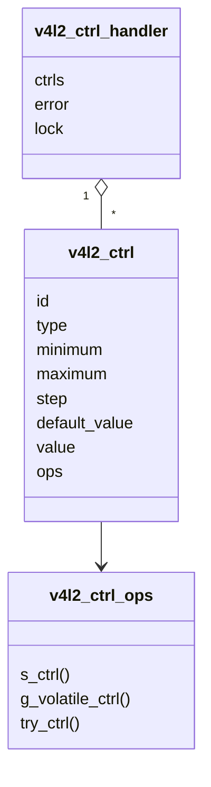
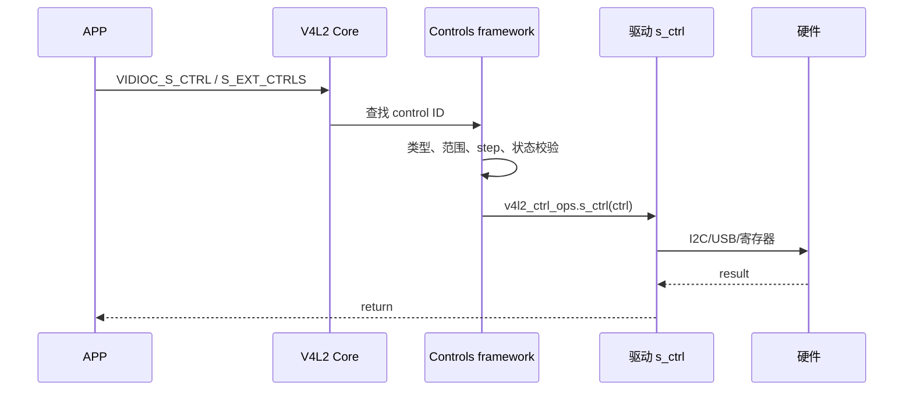

# Controls 参数控制框架

## 1. 为什么需要 controls

如果每个参数都定义一组私有 ioctl，APP 和驱动都会迅速失控。V4L2 用统一的 control ID 描述参数：

```text
V4L2_CID_BRIGHTNESS
V4L2_CID_CONTRAST
V4L2_CID_EXPOSURE
V4L2_CID_GAIN
V4L2_CID_HFLIP
V4L2_CID_VFLIP
```

每个 control 不只是一个整数，还包含：

- 类型。
- 最小/最大值。
- step。
- 默认值。
- flags。
- 菜单项或维度。

## 2. 核心对象



驱动通常在私有对象中保存 handler：

```c
struct my_dev {
    struct v4l2_ctrl_handler ctrl_hdl;
    struct v4l2_ctrl *brightness;
    struct v4l2_ctrl *gain;
};
```

## 3. 初始化

```c
v4l2_ctrl_handler_init(&dev->ctrl_hdl, 4);

dev->brightness =
    v4l2_ctrl_new_std(&dev->ctrl_hdl, &my_ctrl_ops,
                      V4L2_CID_BRIGHTNESS,
                      0, 255, 1, 128);

dev->gain =
    v4l2_ctrl_new_std(&dev->ctrl_hdl, &my_ctrl_ops,
                      V4L2_CID_GAIN,
                      0, 1023, 1, 64);

if (dev->ctrl_hdl.error) {
    ret = dev->ctrl_hdl.error;
    v4l2_ctrl_handler_free(&dev->ctrl_hdl);
    return ret;
}

dev->vdev.ctrl_handler = &dev->ctrl_hdl;
```

Sensor subdev 则常设置：

```c
sd->ctrl_handler = &sensor->ctrl_hdl;
```

## 4. 设置 control 的路径



驱动回调：

```c
static int my_s_ctrl(struct v4l2_ctrl *ctrl)
{
    struct my_dev *dev =
        container_of(ctrl->handler, struct my_dev, ctrl_hdl);

    switch (ctrl->id) {
    case V4L2_CID_BRIGHTNESS:
        return my_hw_set_brightness(dev, ctrl->val);
    case V4L2_CID_GAIN:
        return my_hw_set_gain(dev, ctrl->val);
    default:
        return -EINVAL;
    }
}
```

framework 已完成通用范围校验；驱动负责把抽象值映射到实际硬件。

## 5. `QUERYCTRL`、`G_CTRL`、`S_CTRL`

老接口适合简单 32 位 control：

- `VIDIOC_QUERYCTRL`
- `VIDIOC_G_CTRL`
- `VIDIOC_S_CTRL`

扩展接口适合批量、64 位、字符串、数组或指定 control class：

- `VIDIOC_QUERY_EXT_CTRL`
- `VIDIOC_G_EXT_CTRLS`
- `VIDIOC_S_EXT_CTRLS`
- `VIDIOC_TRY_EXT_CTRLS`

APP 可用 `v4l2-ctl -l` 查看 controls，用 `v4l2-ctl -c gain=100` 设置。

## 6. volatile control

有些值会被硬件自行改变，例如自动曝光开启后的实际曝光值。

这类 control 可标记为 volatile，并在：

```c
static int my_g_volatile_ctrl(struct v4l2_ctrl *ctrl)
```

中从硬件读取当前值。

不要把所有 control 都设计成 volatile，否则每次读取都可能产生昂贵的 I2C/USB 访问。

## 7. control cluster

多个 control 可能存在依赖：

- 自动曝光开关。
- 手动曝光值。

自动模式开启时，手动值可能变为 inactive；关闭自动模式后才允许设置。controls framework 支持 cluster 和 auto cluster，用于统一校验和回调。

这比在多个 ioctl 中手工维护互斥关系可靠。

## 8. control 与硬件状态时机

Sensor 可能在掉电状态收到 control 设置。常见策略：

1. framework 保存 control 当前值。
2. 如果设备已上电，立即写硬件。
3. 如果未上电，只保存；下次 power-on/stream-on 时用 `v4l2_ctrl_handler_setup()` 应用全部当前值。

这样 APP 可以先配置，再启动视频流。

## 9. UVC 中 control ID 怎样落到 Unit

USB 摄像头内部可能包含：

```text
Camera Terminal → Processing Unit → Extension Unit → Output Terminal
```

UVC 驱动解析描述符，建立：

```text
V4L2 control ID
  ↔ UVC entity
  ↔ control selector
  ↔ 数据位宽/偏移
```

因此 APP 只需要设置 `V4L2_CID_BRIGHTNESS`；UVC 驱动负责找到 Processing Unit 的 Brightness selector，再发送 USB class control transfer。

这说明 controls framework 是“用户统一语义”，具体协议映射仍由底层驱动完成。

## 10. Sensor controls

典型 Sensor：

- exposure
- analogue gain
- digital gain
- hblank/vblank
- pixel rate
- link frequency
- test pattern
- hflip/vflip

部分 control 还参与格式和帧率计算：

```text
frame length = height + vblank
frame interval ≈ frame length × line length / pixel rate
```

所以 Sensor 驱动不能孤立地写寄存器，还要维护 control 之间以及 control 与当前 mode 之间的一致性。

## 11. format、selection、control 的边界

| 接口 | 表达什么 |
| --- | --- |
| format | 数据格式、尺寸、色彩编码、stride |
| selection | crop/compose 的矩形区域 |
| stream parameter / frame interval | 帧率或帧间隔 |
| control | 曝光、增益、翻转、测试图等设备行为 |

不要用私有 control 代替已有的标准 format/selection API。

下一篇：[简单 V4L2 设备驱动编写](05-简单V4L2设备驱动编写.md)。
