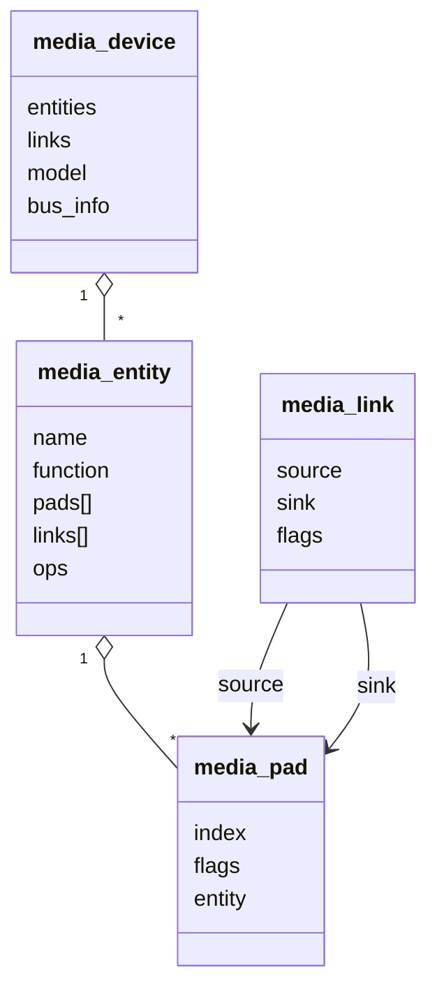

# Media Controller 与 V4L2 Subdev

## 1. 为什么一个 `video_device` 不够

简单设备可被看成整体：

```text
硬件 → 内存 → /dev/video0
```

SoC camera 往往包含多个可独立配置、复用和连接的模块：

```text
Sensor0 ─┐
         ├→ CSI → ISP0 → Scaler0 → Capture0
Sensor1 ─┘        └────→ Scaler1 → Capture1
```

只暴露 `/dev/video0` 会留下问题：

- Sensor 与哪个 CSI 相连？
- ISP 输入来自哪条 link？
- 各模块 sink/source 的格式是否一致？
- 某条线路启动时应该依次调用哪些模块？

因此内核引入两套互补抽象。

## 2. 一句话分工

```text
V4L2 Subdev：
  描述并操作一个功能模块。

Media Controller：
  描述多个模块的拓扑连接。

Video device + vb2：
  在 pipeline 末端或起点与用户空间交换帧。
```

## 3. `v4l2_subdev`

### 3.1 核心结构

一个 subdev 常嵌入具体模块私有对象：

```c
struct my_sensor {
    struct v4l2_subdev sd;
    struct media_pad pad;
    struct v4l2_mbus_framefmt fmt;
    struct v4l2_ctrl_handler ctrls;
    struct mutex lock;

    struct i2c_client *client;
    struct clk *xclk;
    struct regulator_bulk_data supplies[3];
    struct gpio_desc *reset_gpio;
};
```

初始化：

```c
v4l2_i2c_subdev_init(&sensor->sd, client,
                      &my_sensor_ops);
sensor->sd.flags |= V4L2_SUBDEV_FL_HAS_DEVNODE;
sensor->sd.entity.function = MEDIA_ENT_F_CAM_SENSOR;

sensor->pad.flags = MEDIA_PAD_FL_SOURCE;
media_entity_pads_init(&sensor->sd.entity, 1,
                       &sensor->pad);
```

### 3.2 ops 分类

```c
static const struct v4l2_subdev_core_ops my_core_ops = {
    .s_power = my_s_power,
};

static const struct v4l2_subdev_video_ops my_video_ops = {
    .s_stream = my_s_stream,
    .g_frame_interval = my_g_frame_interval,
    .s_frame_interval = my_s_frame_interval,
};

static const struct v4l2_subdev_pad_ops my_pad_ops = {
    .enum_mbus_code = my_enum_mbus_code,
    .enum_frame_size = my_enum_frame_size,
    .get_fmt = my_get_fmt,
    .set_fmt = my_set_fmt,
};

static const struct v4l2_subdev_ops my_sensor_ops = {
    .core  = &my_core_ops,
    .video = &my_video_ops,
    .pad   = &my_pad_ops,
};
```

不同模块实现不同子集：

- Sensor：power、stream、mbus format、frame interval、controls。
- CSI Receiver：sink/source format、lane/virtual channel、stream。
- ISP：sink/source format、crop、processing、stream。
- Scaler：sink/source format、crop/compose、stream。

## 4. Media Controller 对象



### 4.1 entity

graph 中的功能块。subdev 和 video node 都可以拥有 media entity。

### 4.2 pad

entity 的数据端点：

- `MEDIA_PAD_FL_SINK`：数据进入。
- `MEDIA_PAD_FL_SOURCE`：数据输出。

pad 是逻辑数据端点，不应机械理解为一个物理芯片引脚。

### 4.3 link

连接 source pad 与 sink pad：

```text
Sensor:0 [source] → CSI:0 [sink]
```

常见 flags：

- `MEDIA_LNK_FL_ENABLED`
- `MEDIA_LNK_FL_IMMUTABLE`

immutable link 由硬件决定，APP 不能切换；可配置 link 可由 `media-ctl` 或其他管理者启停。

### 4.4 pipeline

多个已启用 link 组成一条可工作的路径。pipeline 不是简单“所有 link 的链表”，它还涉及：

- 同一 pipeline 的使用计数。
- link validation。
- 多个 entity 的协调启动/停止。

## 5. subdev 和 entity 的关系

`v4l2_subdev` 内含一个 `media_entity`：

```text
my_sensor
  └─ v4l2_subdev
       └─ media_entity
            └─ media_pad[0]
```

因此：

- 通过 subdev ops 操作 Sensor。
- 通过 `sd.entity` 把它接进 media graph。

video node 的 `video_device.entity` 也能出现在同一个 graph 中。

## 6. 注册一个 media graph

典型聚合驱动顺序：

```text
media_device_init/register
→ v4l2_device_register
→ 将 v4l2_dev.mdev 指向 media_device
→ 注册本地 CSI/ISP/Scaler subdev
→ 启动 async notifier 等待外部 Sensor
→ notifier bound：记录已绑定 Sensor
→ notifier complete：创建 links、注册 subdev nodes
→ 注册 capture video_device
```

不同 4.9 厂商驱动顺序会调整，但总体对象依赖不变。

## 7. 为什么需要异步绑定

Sensor 是 I2C 驱动，CSI/ISP 是 platform 驱动，它们 probe 顺序没有保证。

如果聚合驱动在 probe 中硬等 Sensor：

- 容易产生 probe ordering 问题。
- 模块化加载困难。
- 多 Sensor 拓扑难扩展。

async notifier 的思路：

```text
聚合驱动从设备树 endpoint 得到“期待的远端设备”
→ 注册 notifier
→ Sensor 以后注册 subdev
→ 框架匹配 fwnode/设备
→ bound 回调建立关联
→ 全部到齐后 complete
```

Linux 4.9 中常见 `v4l2_async_notifier`、`v4l2_async_subdev`；后续内核逐步强化 fwnode endpoint helper，函数和结构体名称有变化。

## 8. 设备树 graph

简化示例：

```dts
sensor@37 {
    compatible = "vendor,my-sensor";
    reg = <0x37>;

    port {
        sensor_out: endpoint {
            remote-endpoint = <&csi_in>;
            clock-lanes = <0>;
            data-lanes = <1 2>;
        };
    };
};

csi {
    ports {
        port@0 {
            csi_in: endpoint {
                remote-endpoint = <&sensor_out>;
                data-lanes = <1 2>;
            };
        };
    };
};
```

设备树描述板级连接；它不会自动替驱动创建所有 media entity 和 link。驱动要解析 endpoint、注册对象并把固件关系映射成 media graph。

## 9. pad format

subdev 使用 `struct v4l2_mbus_framefmt`，描述总线上传输的格式：

- width/height。
- media bus code，例如 Bayer 10-bit、YUYV 8-bit。
- field/colorspace。

这与 `/dev/videoX` 的 memory FourCC 不完全相同：

```text
Sensor/CSI pad：
  MEDIA_BUS_FMT_SRGGB10_1X10

内存 video node：
  V4L2_PIX_FMT_SRGGB10 或经过 ISP 后的 NV12/YUYV
```

一个是模块之间的总线表示，一个是写入内存的像素布局。

## 10. TRY 与 ACTIVE format

subdev pad format 通常区分：

- TRY：某次打开上下文中的试算格式，不立即改硬件状态。
- ACTIVE：当前生效配置。

`set_fmt` 应：

1. 将不支持的 code 修正为支持值。
2. 对 width/height 做范围和对齐约束。
3. 保持 sink/source pad 之间的转换规则。
4. 只在 ACTIVE 时更新设备当前状态。

## 11. link validation

启用 pipeline 并不代表相邻模块格式一定兼容。

link validation 可检查：

- source/sink width、height。
- mbus code。
- field。
- 模块特定限制。

在 streamon 前发现不一致，比 DMA 启动后才花屏或超时更好。

## 12. 用户空间怎样看

```sh
media-ctl -p -d /dev/media0
media-ctl --print-dot -d /dev/media0
v4l2-ctl -D -d /dev/v4l-subdev0
v4l2-ctl --get-subdev-fmt pad=0 -d /dev/v4l-subdev0
```

配置 link 示例：

```sh
media-ctl -d /dev/media0 \
  -l '"sensor":0 -> "csi":0 [1]'
```

设置 pad format 示例语法因 v4l2-utils 版本略有差异：

```sh
media-ctl -d /dev/media0 \
  -V '"sensor":0 [fmt:SRGGB10_1X10/1920x1080]'
```

下一篇：[MIPI 摄像头 Pipeline 与驱动编写](07-MIPI摄像头Pipeline与驱动编写.md)。
