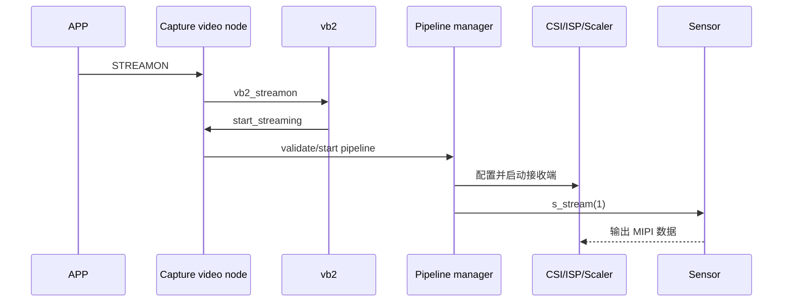

# MIPI 摄像头 Pipeline 与驱动编写

## 1. 先区分两条物理路径


- I2C/CCI 是控制路径：配置 mode、曝光、增益、stream on/off。
- MIPI CSI-2 是高速数据路径：Sensor 输出像素流。

“APP 设置曝光”不会沿 MIPI 数据 lane 发送；“图像帧”也不会经 I2C 搬运。

## 2. 软件对象映射

| 硬件模块 | 常见软件对象 |
| --- | --- |
| Sensor | I2C driver + `v4l2_subdev` + source pad + controls |
| D-PHY/CSI Receiver | platform driver + subdev + sink/source pads |
| ISP | subdev + sink/source pads + controls/metadata |
| Scaler | subdev + crop/compose + sink/source pads |
| Capture/DMA | `video_device` + `vb2_queue` + media entity |
| 整条 camera | `media_device` + `v4l2_device` + async notifier |

## 3. Sensor subdev 驱动

### 3.1 probe 阶段

```text
I2C 匹配
→ 分配 sensor 私有对象
→ 获取 xclk、regulator、reset/pwdn GPIO
→ 初始化 mutex 和 mode 默认值
→ v4l2_i2c_subdev_init
→ 初始化 source pad 和 media entity
→ 初始化 controls
→ 解析 endpoint：lane 数、link frequency 等
→ 注册 async subdev
```

骨架：

```c
static int sensor_probe(struct i2c_client *client,
                        const struct i2c_device_id *id)
{
    struct my_sensor *s;
    int ret;

    s = devm_kzalloc(&client->dev, sizeof(*s), GFP_KERNEL);
    if (!s)
        return -ENOMEM;

    mutex_init(&s->lock);
    s->client = client;
    s->cur_mode = &supported_modes[0];

    ret = sensor_get_resources(s);
    if (ret)
        return ret;

    v4l2_i2c_subdev_init(&s->sd, client, &sensor_ops);
    s->sd.flags |= V4L2_SUBDEV_FL_HAS_DEVNODE;
    s->sd.entity.function = MEDIA_ENT_F_CAM_SENSOR;

    s->pad.flags = MEDIA_PAD_FL_SOURCE;
    ret = media_entity_pads_init(&s->sd.entity, 1, &s->pad);
    if (ret)
        return ret;

    ret = sensor_init_controls(s);
    if (ret)
        goto err_entity;

    s->sd.ctrl_handler = &s->ctrls;

    ret = v4l2_async_register_subdev(&s->sd);
    if (ret)
        goto err_ctrls;

    return 0;

err_ctrls:
    v4l2_ctrl_handler_free(&s->ctrls);
err_entity:
    media_entity_cleanup(&s->sd.entity);
    return ret;
}
```

### 3.2 mode table

Sensor 驱动通常把寄存器配置按 mode 组织：

```c
struct sensor_mode {
    u32 width;
    u32 height;
    u32 code;
    struct v4l2_fract max_fps;
    u64 pixel_rate;
    u32 hts;
    u32 vts;
    const struct regval *reg_list;
    unsigned int num_regs;
};
```

`set_fmt` 选择最合适 mode，更新：

- 当前 mbus code 和尺寸。
- hblank/vblank 范围。
- pixel rate/link frequency controls。

通常只保存配置，不在每次 `set_fmt` 时立即启动输出。

### 3.3 power-on

典型顺序：

```text
enable regulators
→ 配置/启用 xclk
→ reset/pwdn GPIO 时序
→ 等待 datasheet 指定时间
→ I2C 读 chip ID
```

失败时严格反向回滚。

### 3.4 `s_stream`

```c
static int sensor_s_stream(struct v4l2_subdev *sd, int on)
{
    struct my_sensor *s = to_my_sensor(sd);
    int ret = 0;

    mutex_lock(&s->lock);

    if (on) {
        ret = sensor_power_on(s);
        if (ret)
            goto out;

        ret = sensor_write_regs(s, s->cur_mode->reg_list,
                                s->cur_mode->num_regs);
        if (ret)
            goto power_off;

        ret = v4l2_ctrl_handler_setup(&s->ctrls);
        if (ret)
            goto power_off;

        ret = sensor_write_reg(s, MODE_SELECT, STREAMING);
        if (ret)
            goto power_off;
    } else {
        sensor_write_reg(s, MODE_SELECT, STANDBY);
        sensor_power_off(s);
    }
    goto out;

power_off:
    sensor_power_off(s);
out:
    mutex_unlock(&s->lock);
    return ret;
}
```

具体平台可能由 runtime PM 管理上电，原则是“格式/mode、controls、stream 状态一致”。

## 4. CSI/ISP/Scaler subdev

这些模块通常有至少一个 sink 和一个 source pad：

```c
enum {
    PAD_SINK,
    PAD_SOURCE,
    PAD_MAX,
};
```

### CSI Receiver

负责：

- 配置 D-PHY lane、时钟和 CSI-2 receiver。
- 检查 data type/virtual channel。
- 把 sink format 传播到 source。
- 处理同步、ECC/CRC、FIFO overflow 等错误。

### ISP

负责：

- 接收 Bayer/YUV。
- 输出处理后的 YUV/RGB 或 raw bypass。
- crop、统计信息和 ISP controls。
- 可能暴露 metadata/statistics video node。

### Scaler

负责：

- sink crop。
- source compose/缩放。
- 输出尺寸和对齐限制。

每个模块只应承诺自身真实能力；不能为了让 pipeline “看起来能配”而接受硬件无法实现的任意格式。

## 5. Capture/DMA 驱动

Capture 是 pipeline 与 APP 的交界：

```text
上游 subdev source pad
  → Capture entity sink pad
  → DMA
  → vb2 buffer
  → /dev/videoX
```

它通常包含：

- `video_device`
- `vb2_queue`
- media pad（常为 sink）
- DMA channel/寄存器/IRQ
- active buffer list

`buf_queue` 把 DMA 地址加入驱动队列；中断完成后调用 `vb2_buffer_done()`。这部分与简单驱动相同，只是 streamon 还要协调上游 pipeline。

## 6. 聚合驱动

聚合驱动负责把独立 probe 的模块拼起来：

```text
初始化 media_device + v4l2_device
→ 注册本地 subdev
→ 根据设备树 endpoints 建 async match
→ Sensor bound
→ 创建 Sensor→CSI 等 link
→ 创建 CSI→ISP→Scaler→Capture link
→ 注册 subdev devnodes
→ 注册 capture video nodes
→ media_device_register
```

伪代码：

```c
static int camera_probe(struct platform_device *pdev)
{
    struct camera_dev *cam;
    int ret;

    cam = devm_kzalloc(&pdev->dev, sizeof(*cam), GFP_KERNEL);
    if (!cam)
        return -ENOMEM;

    media_device_init(&cam->mdev);
    strlcpy(cam->mdev.model, "My Camera",
            sizeof(cam->mdev.model));
    cam->mdev.dev = &pdev->dev;

    ret = v4l2_device_register(&pdev->dev, &cam->v4l2_dev);
    if (ret)
        goto err_mdev;
    cam->v4l2_dev.mdev = &cam->mdev;

    ret = camera_register_internal_subdevs(cam);
    if (ret)
        goto err_v4l2;

    ret = camera_parse_endpoints_and_register_notifier(cam);
    if (ret)
        goto err_internal;

    return 0;

err_internal:
    camera_unregister_internal_subdevs(cam);
err_v4l2:
    v4l2_device_unregister(&cam->v4l2_dev);
err_mdev:
    media_device_cleanup(&cam->mdev);
    return ret;
}
```

## 7. 格式协商和传播

复杂 pipeline 里有两种常见策略。

### 策略 A：用户空间显式配置

APP 用 `media-ctl` 逐个设置：

```text
Sensor source pad
→ CSI sink/source
→ ISP sink/source
→ Scaler sink/source
→ video node memory format
```

优点是灵活、拓扑透明；缺点是 APP 必须理解 pipeline。

### 策略 B：capture 驱动向上游传播

APP 对 `/dev/videoX` 做 `S_FMT`，主驱动通过 subdev calls 向上游协商。

优点是 APP 简单；缺点是主驱动逻辑复杂，且多路线选择仍可能需要 Media Controller。

无论采用哪种策略，都必须保持：

```text
相邻 pad 的 mbus format 兼容
最终内存 FourCC 与 capture DMA 布局兼容
crop/scale 后尺寸与 video node 尺寸一致
```

## 8. streamon 的典型顺序

不同硬件对启动顺序有要求。常见原则是先准备接收端，避免 Sensor 已发送但下游未就绪：

```text
APP QBUF
→ vb2 把 buffer 交给 capture
→ 校验 media pipeline
→ 配置 capture DMA
→ 启动下游 Capture/Scaler/ISP/CSI
→ 最后调用 Sensor s_stream(1)
```

有些 SoC 要求局部顺序不同，应服从硬件手册。



## 9. streamoff 与错误回滚

通常反向停止：

```text
Sensor s_stream(0)
→ 停 CSI/ISP/Scaler
→ 停 Capture DMA 和 IRQ
→ 归还全部 active vb2 buffer
→ media pipeline stop
```

任意一级启动失败：

1. 只回滚已经成功启动的模块。
2. 保证 Sensor 不再输出。
3. 清除 DMA/IRQ 状态。
4. 归还 buffer。
5. 保持下一次 streamon 仍可重试。

## 10. 不同驱动各自负责什么

| 驱动 | 必须负责 | 不应负责 |
| --- | --- | --- |
| Sensor | I2C、供电时序、mode、controls、输出开关 | 用户内存 buffer |
| CSI | lane/receiver、协议错误、mbus 输入输出 | 替 Sensor 算曝光 |
| ISP | 图像处理、格式转换、统计 | Sensor 电源时序 |
| Scaler | crop/compose/缩放 | DMA buffer 生命周期 |
| Capture | video node、vb2、DMA、IRQ | Sensor 私有寄存器表 |
| 聚合驱动 | 绑定、links、pipeline 协调 | 重复实现每块硬件细节 |

## 11. 从 4.9 走向 6.x

总体设计仍相同：

- subdev 表示模块。
- Media Controller 表示 graph。
- vb2 管 buffer。
- capture video node 交付帧。

主要变化集中于：

- async notifier 与 fwnode API。
- endpoint parsing helper。
- subdev state/TRY format 管理。
- 部分 pad ops、routing 和 stream API。

先掌握本文对象边界，后续迁移主要是查目标版本函数签名，而不是重学整个架构。

下一篇：[完整数据流与典型调用链](08-完整数据流与典型调用链.md)。
