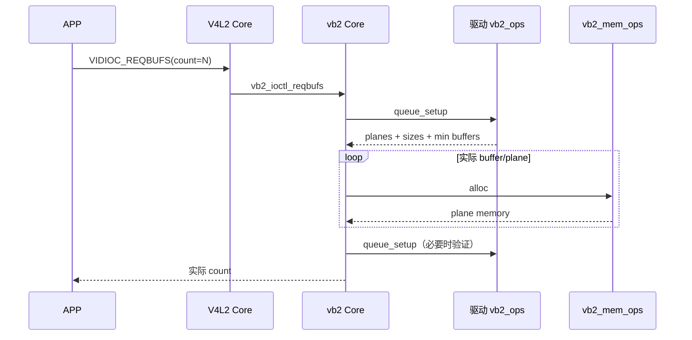
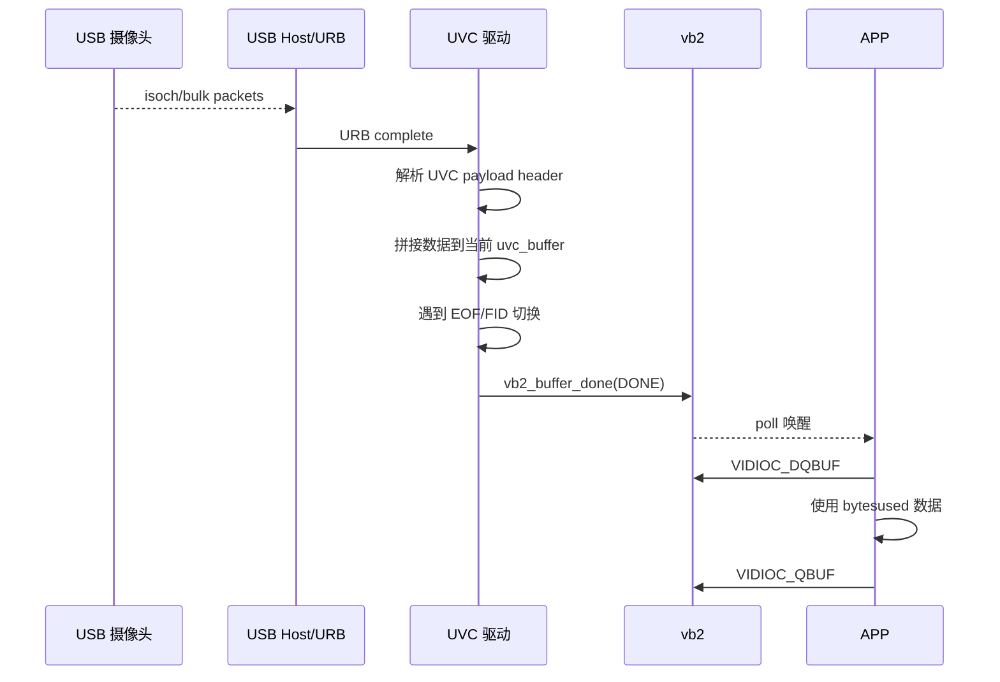
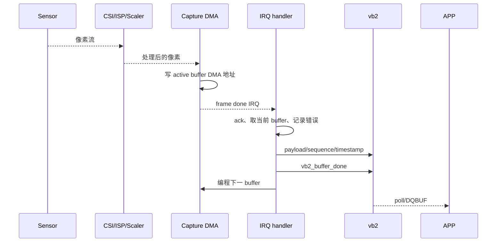
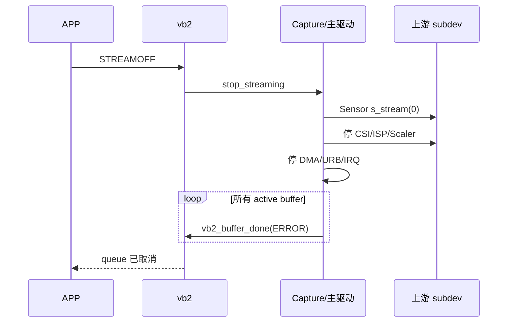
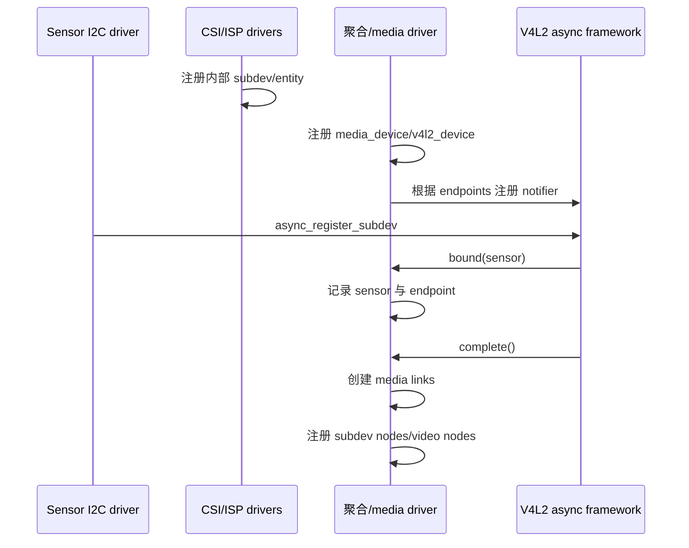

# 完整数据流与典型调用链

本篇把前文分散的对象重新放回完整路径。阅读源码时可以把这里当作索引。

## 1. `VIDIOC_S_FMT`

```text
APP
└─ ioctl(fd, VIDIOC_S_FMT, &fmt)
   └─ VFS
      └─ V4L2 公共 unlocked_ioctl
         └─ video_ioctl2()
            └─ 公共参数复制和 ioctl 检查
               └─ v4l2_ioctl_ops.vidioc_s_fmt_vid_cap()
                  ├─ 检查 vb2 queue 是否 busy
                  ├─ try_fmt 修正格式
                  ├─ 保存设备当前格式
                  └─ 简单设备：准备硬件格式
                     复杂设备：向 subdev 传播或等待 media 配置
```

关键边界：

- Core 负责 ABI 和分发。
- 驱动负责设备是否支持、如何修正和保存格式。
- subdev pad 使用 mbus format，video node 使用 memory pixel format。

## 2. 设置 control

```text
APP VIDIOC_S_CTRL / S_EXT_CTRLS
→ video_ioctl2
→ V4L2 controls framework
→ 按 ID 找到 v4l2_ctrl
→ 范围、step、flags、cluster 校验
→ v4l2_ctrl_ops.s_ctrl
→ 简单驱动：写寄存器
→ UVC：entity + selector → USB control transfer
→ Sensor：I2C 写 exposure/gain 等寄存器
```

如果设备未上电，驱动可只保存 control 值，在 streamon 时通过 `v4l2_ctrl_handler_setup()` 应用。

## 3. `VIDIOC_REQBUFS`



## 4. `VIDIOC_QBUF`

```text
APP QBUF(index)
→ video_ioctl2
→ vb2_ioctl_qbuf
→ 根据 index 找 vb2_buffer
→ 将 v4l2_buffer/planes 转入 vb2 表示
→ vb2_ops.buf_prepare
→ 状态 QUEUED
→ 若 streaming 已开始：
   → cache/memory prepare
   → 状态 ACTIVE
   → vb2_ops.buf_queue
      → 驱动 active/irq queue
      → 必要时编程下一块 DMA
```

QBUF 的含义是交出所有权，不保证在 ioctl 返回前硬件已经写了它。

## 5. `VIDIOC_STREAMON`

### 5.1 简单设备

```text
APP STREAMON
→ vb2_streamon
→ 把已排队 buffer 交给驱动 buf_queue
→ 驱动 start_streaming
→ 提交 URB / 启动 DMA / 启动虚拟线程
```

### 5.2 MIPI pipeline

```text
APP STREAMON(/dev/videoX)
→ capture vb2 start_streaming
→ media_entity_pipeline_start / link validation
→ capture 准备 DMA buffer
→ CSI/ISP/Scaler s_stream(1)
→ Sensor s_stream(1)
→ Sensor 开始发送 MIPI 数据
```

具体调用可能通过聚合驱动遍历 subdev，也可能由厂商 pipeline manager 完成。

## 6. UVC 一帧怎样到 APP



UVC 驱动通常还有自己的 `irqqueue`：

```text
vb2 queued/active
  ↔ UVC irqqueue
  ↔ URB 解包使用的当前 buffer
  → vb2 done queue
```

这正是“vb2 队列”和“驱动私有硬件队列”不能混为一谈的实例。

## 7. SoC DMA 一帧怎样到 APP



如果 active queue 为空：

- 硬件可能停流。
- 丢弃帧。
- 写 scratch buffer。
- 报 underrun。

策略由硬件能力决定，但不能写入已归还 APP 的 buffer。

## 8. `VIDIOC_DQBUF`

```text
APP DQBUF
→ vb2_ioctl_dqbuf
→ done queue 为空？
   ├─ O_NONBLOCK：-EAGAIN
   └─ blocking：wait_prepare → sleep
→ buffer_done 唤醒
→ wait_finish
→ 从 done queue 摘除
→ vb2_ops.buf_finish
→ memory finish/cache sync
→ 填 v4l2_buffer
→ 状态 DEQUEUED
→ APP 重新拥有
```

## 9. `VIDIOC_STREAMOFF`



停止后还发生 frame-done 中断，是典型竞态。驱动必须通过关中断、同步 IRQ、状态位和锁保证旧完成路径不再访问已取消 buffer。

## 10. MIPI 注册时序



probe 顺序可以变化，async framework 的作用就是在对象全部出现后完成拼装。

## 11. 从源码切入的建议

### 想理解 ioctl

```text
drivers/media/v4l2-core/v4l2-dev.c
drivers/media/v4l2-core/v4l2-ioctl.c
目标驱动的 v4l2_ioctl_ops
```

### 想理解 buffer

```text
drivers/media/v4l2-core/videobuf2-v4l2.c
drivers/media/v4l2-core/videobuf2-core.c
目标驱动的 vb2_ops 和完成中断
```

### 想理解 UVC

```text
drivers/media/usb/uvc/uvc_driver.c
drivers/media/usb/uvc/uvc_queue.c
drivers/media/usb/uvc/uvc_video.c
drivers/media/usb/uvc/uvc_ctrl.c
```

### 想理解 MIPI

```text
Sensor 的 I2C subdev 驱动
CSI/ISP/Scaler 的 platform subdev 驱动
Capture/DMA video node
上层 media 聚合驱动
设备树 ports/endpoints
```

最后一篇：[调试工具与常见问题](09-调试工具与常见问题.md)。
