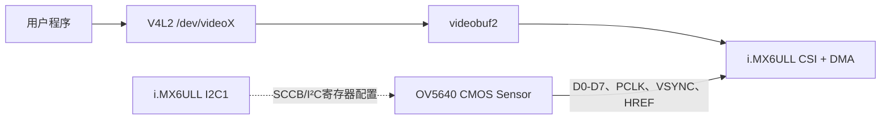

# OV5640 v2 驱动与 i.MX6ULL 摄像头架构分析

> 适用环境：100ASK i.MX6ULL、Linux 4.9.88、NXP/100ASK BSP、OV5640 DVP 摄像头。
>
> 核心源码：`drivers/media/platform/mxc/capture/ov5640_v2.c`、`mx6s_capture.c`，以及实际板级 DTS。

## 1. 分析方法

学习摄像头驱动时会同时遇到 CMOS、I²C、DVP、MIPI、CSI、platform、V4L2、subdev、vb2 和 DMA。不要从大段 Sensor 寄存器表开始读，先建立系统地图：

```text
确认硬件与物理连线
    → 区分控制通道、数据通道
    → 在设备树中找到设备
    → 判断设备属于哪条总线
    → 找到 driver、match、probe
    → 分析 probe 获取的资源和注册的对象
    → 从用户 ioctl 反向追踪运行调用链
    → 根据日志和现象分层定位
```

阅读每个函数时问三个问题：

1. 它属于控制通道还是图像数据通道？
2. 它属于 Sensor 驱动还是 CSI Capture 驱动？
3. 它发生在注册、参数配置还是采集运行阶段？

## 2. CMOS、DVP、MIPI、CSI、V4L2不是同一层

容易写成 `COMS`，正确写法是 `CMOS`。CMOS 描述感光器件技术，不描述图像怎样传给 SoC。

OV5640 是 CMOS 图像传感器，内部包含像素阵列、模数转换、曝光和增益控制、部分 ISP、PLL、时序发生器及图像输出接口。

| 名称 | 层次 | 本项目中的作用 |
| --- | --- | --- |
| CMOS | 感光技术 | OV5640 的感光方式 |
| OV5640 | Sensor 型号 | 把光转换成数字图像 |
| SCCB/I²C | 控制总线 | 配置 Sensor 寄存器 |
| DVP | 并行数据接口 | 传输像素、像素时钟和同步信号 |
| MIPI CSI-2 | 串行图像协议 | 通过 D-PHY Lane 传输图像包 |
| i.MX6ULL CSI | SoC 摄像头控制器 | 接收本项目的 DVP 并行数据 |
| V4L2 | Linux 视频框架 | 向应用提供标准视频接口 |

## 3. 当前项目是 DVP，不是 MIPI CSI-2



控制通道：

```text
i.MX6ULL I2C1 → OV5640寄存器
              → 分辨率、帧率、曝光、增益、输出格式
```

数据通道：

```text
OV5640 → D0～D7、PCLK、VSYNC、HREF
       → i.MX6ULL CSI → DMA → 内存图像帧
```

因此：

- I²C 能读芯片 ID，只证明控制通道基本正常；
- `/dev/videoX` 出现，只证明 Capture 设备完成注册；
- 连续抓到内容正确的帧，才证明完整链路正常。

最容易混淆的是 `CSI`：MIPI CSI-2 是串行摄像头协议，而 i.MX6ULL 手册中的 CSI 是 Camera Sensor Interface 控制器。本项目主线是：

```text
ov5640_v2.c + mx6s_capture.c
```

不是 `ov5640_mipi.c` 或 `ov5640_mipi_v2.c`。

## 4. 为什么需要两个驱动

| 驱动 | 管理硬件 | 主要职责 |
| --- | --- | --- |
| `ov5640_v2.c` | OV5640 Sensor | 供电、时钟、复位、I²C、寄存器表、工作模式 |
| `mx6s_capture.c` | i.MX6ULL CSI | 寄存器、IRQ、DMA、vb2、`/dev/videoX` |

OV5640 驱动不负责用户 buffer 和 CSI DMA；CSI 驱动也不应理解 OV5640 私有寄存器。

```text
ov5640_v2.c
└── struct v4l2_subdev
           │ endpoint + v4l2_async_notifier
           ▼
mx6s_capture.c
├── struct v4l2_device
├── struct video_device
├── struct vb2_queue
├── CSI寄存器、IRQ、DMA
└── /dev/videoX
```

## 5. device/driver：这里有两套总线模型

### 5.1 OV5640 是 I²C device

OV5640 挂在设备树 `&i2c1` 下：

```dts
&i2c1 {
    ov5640: ov5640@3c {
        compatible = "ovti,ov5640";
        reg = <0x3c>;
    };
};
```

I²C Core 创建 `struct i2c_client`，Sensor 驱动注册 `struct i2c_driver`：

```c
static struct i2c_driver ov5640_i2c_driver = {
    .driver = {
        .name = "ov5640",
    },
    .probe    = ov5640_probe,
    .remove   = ov5640_remove,
    .id_table = ov5640_id,
};
```

```text
设备树 ov5640@3c
    → I²C Core 创建 i2c_client
    → 匹配 i2c_driver
    → 调用 ov5640_probe(client, id)
```

所以 `ov5640_v2.c` 严格说是 I²C 驱动，不是 platform 驱动。

### 5.2 i.MX6ULL CSI 是 platform device

CSI 是 SoC 内部 MMIO 硬件，拥有寄存器地址、IRQ、时钟和 DMA 能力。设备树节点形成 `struct platform_device`，`mx6s_capture.c` 注册 `struct platform_driver`：

```c
static const struct of_device_id mx6s_csi_dt_ids[] = {
    { .compatible = "fsl,imx6s-csi" },
    { .compatible = "fsl,imx6sl-csi" },
    { }
};

static struct platform_driver mx6s_csi_driver = {
    .driver = {
        .of_match_table = mx6s_csi_dt_ids,
    },
    .probe  = mx6s_csi_probe,
    .remove = mx6s_csi_remove,
};
```

```text
设备树 CSI 节点
    → OF/platform 创建 platform_device
    → compatible 匹配 mx6s_csi_dt_ids
    → 调用 mx6s_csi_probe(pdev)
```

| 硬件 | Linux device | Linux driver | probe 参数 |
| --- | --- | --- | --- |
| OV5640 | `i2c_client` | `i2c_driver` | `struct i2c_client *` |
| i.MX6ULL CSI | `platform_device` | `platform_driver` | `struct platform_device *` |

不是所有外设都应写成 platform 驱动。先看硬件总线：I²C 外设用 I²C 模型，SPI 外设用 SPI 模型，SoC 内部 MMIO 外设通常用 platform 模型。

## 6. 设备树还描述视频连接

Sensor 节点除了 I²C 地址，还提供 pinctrl、MCLK、PWDN 和 RESET 等本地资源：

```dts
ov5640: ov5640@3c {
    compatible = "ovti,ov5640";
    reg = <0x3c>;
    pinctrl-0 = <&pinctrl_csi1>;
    clocks = <&clks IMX6UL_CLK_CSI>;
    clock-names = "csi_mclk";
    pwn-gpios = <...>;
    rst-gpios = <...>;
    csi_id = <0>;
    mclk = <24000000>;
    mclk_source = <0>;
};
```

属性名必须与当前驱动读取的名字完全一致：

```c
of_get_named_gpio(dev->of_node, "pwn-gpios", 0);
of_get_named_gpio(dev->of_node, "rst-gpios", 0);
of_property_read_u32(dev->of_node, "mclk", ...);
of_property_read_u32(dev->of_node, "mclk_source", ...);
of_property_read_u32(dev->of_node, "csi_id", ...);
```

不能直接套用新内核示例中的 `powerdown-gpios`、`reset-gpios`。

两端用 endpoint 描述图像数据连接：

```dts
ov5640_ep: endpoint {
    remote-endpoint = <&csi1_ep>;
};

csi1_ep: endpoint {
    remote-endpoint = <&ov5640_ep>;
};
```

它表达：

```text
OV5640输出端 ←────────→ i.MX6ULL CSI输入端
```
## 7. `ov5640_v2.c` 的主要数据结构

### 7.1 寄存器表项

```c
struct reg_value {
    u16 u16RegAddr;
    u8  u8Val;
    u8  u8Mask;
    u32 u32Delay_ms;
};
```

一项表示“16 位寄存器地址 + 8 位数据 + 可选位掩码 + 写入后延时”。`ov5640_download_firmware()` 遍历数组，通过 I²C 写入 Sensor。这里的 `firmware` 并不是独立固件文件，本质是寄存器配置表。

### 7.2 工作模式

```c
struct ov5640_mode_info {
    enum ov5640_mode mode;
    u32 width;
    u32 height;
    struct reg_value *init_data_ptr;
    u32 init_data_size;
};
```

一个 mode 绑定模式编号、分辨率和寄存器表。`ov5640_mode_info_data[2][...]` 第一维对应 15 fps 和 30 fps。驱动包含 VGA、QVGA、720P、1080P、QSXGA 等离散模式，但 1080P 和 QSXGA 的 30 fps 表项为空。

### 7.3 Sensor 私有状态

```c
struct ov5640 {
    struct v4l2_subdev subdev;
    struct i2c_client *i2c_client;
    struct v4l2_pix_format pix;
    const struct ov5640_datafmt *fmt;
    struct v4l2_captureparm streamcap;
    struct clk *sensor_clk;
    u32 mclk;
    int csi;
    ...
};
```

它保存 subdev、I²C 客户端、当前格式、帧率、时钟和状态。当前代码却使用一个全局实例：

```c
static struct ov5640 ov5640_data;
```

GPIO、regulator 和部分曝光状态也是全局变量，说明它实际按“系统中只有一颗 OV5640”设计，多实例能力较弱，是典型厂商老 BSP 风格。

## 8. 沿 `ov5640_probe()` 分析 Sensor 驱动

不要先读数百行寄存器表，先抓住 probe 主干：

```text
ov5640_probe
├─ 选择默认pinctrl
├─ 获取pwn-gpios、rst-gpios
├─ 获取csi_mclk
├─ 读取mclk、mclk_source、csi_id
├─ 设置并开启MCLK
├─ 获取并使能DOVDD、DVDD、AVDD
├─ 执行RESET/PWDN时序
├─ I²C读取0x300A、0x300B
├─ init_device
│  └─ ov5640_init_mode
│     ├─ 软件复位
│     ├─ 写全局初始化表
│     ├─ 写30fps VGA初始化表
│     ├─ 设置驱动能力和防闪烁
│     └─ 设置自动曝光目标
├─ v4l2_i2c_subdev_init
└─ v4l2_async_register_subdev
```

### 8.1 pinctrl、PWDN、RESET

`devm_pinctrl_get_select_default()` 选择设备树默认 pinctrl。若 CSI PAD 与 UART6、ECSPI1 冲突，probe 可能失败，或图像数据通道无法工作。

驱动申请 PWDN、RESET GPIO 并执行时序。分析外部实际电平时必须同时结合：

- 原理图中的有效高/低；
- 74HC595 输出编号；
- DTS GPIO flags；
- `gpio_set_value_cansleep()` 调用顺序。

不能只看代码中的 0/1 就断言引脚实际电平。

### 8.2 MCLK 与电源

驱动把 `mclk` 限制在 6～24 MHz，然后调用：

```c
clk_set_rate(sensor_clk, mclk);
clk_prepare_enable(sensor_clk);
```

没有参考时钟时，Sensor 可能无法可靠响应 I²C，所以芯片识别失败时要先测 MCLK。

驱动还尝试取得 DOVDD、DVDD、AVDD。若板上使用固定电源而没有 regulator 描述，当前驱动只发 warning 并继续；是否致命要结合板级供电判断。

### 8.3 芯片 ID 是重要分界点

```text
0x300A → 期望0x56
0x300B → 期望0x40
```

合起来是 `0x5640`：

```text
读不到0x5640
    → 查供电、MCLK、PWDN、RESET、I²C和地址

读到0x5640
    → 控制通道基本打通，再查初始化表、CSI和数据通道
```

### 8.4 注册 V4L2 subdev

```c
v4l2_i2c_subdev_init(&ov5640_data.subdev,
                      client, &ov5640_subdev_ops);
v4l2_async_register_subdev(&ov5640_data.subdev);
```

第一句把 I²C Sensor 包装成 V4L2 subdev；第二句通知 async 框架它已经准备好。Sensor subdev 注册并不直接创建 `/dev/videoX`。

## 9. I²C 寄存器读写

OV5640 使用 16 位寄存器地址、8 位数据。写操作发送：

```text
寄存器地址高8位 → 地址低8位 → 寄存器值
```

读操作分两步：

```text
发送16位寄存器地址 → 接收1字节值
```

这条 I²C 链路只传控制命令，不传图像像素。

当表项 Mask 非零时，驱动执行读改写：

```text
old = read(reg)
new = (old & ~mask) | (value & mask)
write(reg, new)
```

## 10. mode、格式和帧率

Sensor 只声明一种 media bus code：

```c
MEDIA_BUS_FMT_YUYV8_2X8
```

CSI 驱动再映射为内存 FourCC，例如：

```text
MEDIA_BUS_FMT_YUYV8_2X8 → V4L2_PIX_FMT_YUYV
```

- media bus code 描述模块之间线路上的数据组织；
- V4L2 FourCC 描述 DMA 写入内存后的像素布局。

当前 `set_fmt()` 主要校验 mbus code，没有根据 width/height 选择寄存器 mode。实际模式切换主要发生在 `s_parm()`：

```c
ov5640_change_mode(frame_rate,
                   capture.capturemode);
```

这是老 BSP 习惯：`capturemode` 被当成 mode 数组下标。驱动只接受 15 fps 或 30 fps；高分辨率切换还会重新计算曝光。

## 11. `mx6s_capture.c` 怎样创建 `/dev/videoX`

```text
mx6s_csi_probe
├─ 分配struct mx6s_csi_dev
├─ platform_get_resource取得寄存器资源
├─ platform_get_irq取得IRQ
├─ devm_ioremap_resource映射寄存器
├─ 获取CSI相关时钟
├─ v4l2_device_register
├─ 分配struct video_device
├─ 设置fops、ioctl_ops和vb2 queue
├─ video_register_device → /dev/videoX
├─ devm_request_irq注册CSI中断
├─ 解析endpoint并注册async notifier
└─ 启用runtime PM
```

三个对象的区别：

| 对象 | 作用 |
| --- | --- |
| `v4l2_device` | 聚合和管理一组 V4L2 对象 |
| `video_device` | 对应视频字符设备，通常形成 `/dev/videoX` |
| `v4l2_subdev` | 表示 Sensor、CSI Receiver、ISP 等子模块 |

本项目是：

```text
OV5640 → v4l2_subdev
i.MX6ULL Capture → video_device → /dev/videoX
```

`video_device` 安装：

```c
vdev->fops      = &mx6s_csi_fops;
vdev->ioctl_ops = &mx6s_csi_ioctl_ops;
```

`fops` 处理 open、release、read、poll、mmap 和文件层 ioctl。`unlocked_ioctl = video_ioctl2` 先进入 V4L2 Core，再由 Core 根据命令分发到 `v4l2_ioctl_ops`：

```text
VIDIOC_S_FMT     → mx6s_vidioc_s_fmt_vid_cap
VIDIOC_REQBUFS   → mx6s_vidioc_reqbufs
VIDIOC_QBUF      → mx6s_vidioc_qbuf
VIDIOC_DQBUF     → mx6s_vidioc_dqbuf
VIDIOC_STREAMON  → mx6s_vidioc_streamon
VIDIOC_STREAMOFF → mx6s_vidioc_streamoff
```

## 12. Sensor 与 CSI 怎样异步绑定

设备 probe 顺序不确定：可能 Sensor 先 probe，也可能 CSI 先 probe。CSI 驱动执行：

```text
从自己的port找到remote-endpoint
    → 找到远端OV5640设备树节点
    → 建立V4L2_ASYNC_MATCH_OF匹配项
    → v4l2_async_notifier_register
```

Sensor 驱动执行：

```text
v4l2_async_register_subdev
```

两边都准备好后，V4L2 async framework 调用 CSI 的 `bound()`：

```c
static int subdev_notifier_bound(...,
                                 struct v4l2_subdev *subdev,
                                 ...)
{
    ...
    csi_dev->sd = subdev;
    ...
}
```

随后 Capture 驱动可以通过：

```c
v4l2_subdev_call(csi_dev->sd, ...);
```

调用 Sensor 提供的 subdev 回调。

两种机制的职责不同：

```text
async framework
    → 解决Sensor和CSI的probe顺序不确定

设备树endpoint
    → 指出CSI应该等待并绑定哪一个Sensor
```

这里没有要求 OV5640 和 CSI 必须按固定顺序加载模块。

## 13. videobuf2、DMA 与一帧图像

videobuf2 管理通用 buffer 生命周期：

```text
DEQUEUED → PREPARED → QUEUED → ACTIVE → DONE → DEQUEUED
```

CSI 驱动提供 `queue_setup`、`buf_prepare`、`buf_queue`、`start_streaming` 和 `stop_streaming`。vb2 管通用状态，驱动管硬件队列与 DMA 寄存器。

### 13.1 STREAMON

```text
APP ioctl(VIDIOC_STREAMON)
    → V4L2 Core / video_ioctl2
    → mx6s_vidioc_streamon
    → vb2_streamon
    → mx6s_start_streaming
    → 从capture队列取两块buffer
    → 获得DMA物理地址
    → 写入CSI的两个帧地址寄存器
    → 启动CSI、DMA和中断
    → OV5640持续发送DVP像素
```

CSI 使用两个硬件帧地址形成 ping-pong buffer。驱动还分配 discard buffer：应用没有及时提供新 buffer 时，用它承接并丢弃帧，避免硬件写入已经归还给应用的内存。

### 13.2 一帧完成

```text
OV5640输出一帧
    → CSI按PCLK和同步信号接收
    → DMA写入当前buffer
    → frame done IRQ
    → 中断处理函数确认完成buffer
    → 填写sequence、timestamp、payload
    → vb2_buffer_done(DONE)
    → 唤醒poll/VIDIOC_DQBUF
    → APP取得一帧
```

## 14. 这份 Linux 4.9 驱动的老 BSP 特征

### 14.1 没有完整的现代 Media Controller 拓扑

驱动使用 `v4l2_subdev` 和 async notifier，但没有像现代 Sensor 驱动那样完整初始化 media entity、source pad、controls 和 runtime PM 状态。Linux 6.x 教程不能逐行硬套，总体分层思想相同，但 API 和完整度不同。

### 14.2 Sensor 没有实现 `s_stream()`

CSI 驱动 STREAMON 后调用：

```c
v4l2_subdev_call(sd, video, s_stream, 1);
```

但 `ov5640_v2.c` 的 video ops 只有 `.g_parm`、`.s_parm`，没有 `.s_stream`。说明它主要在 probe/init 和 mode 切换时就配置 Sensor 输出，而不是严格通过 `s_stream()` 开关数据流。CSI 驱动也没有检查该 subdev call 的返回值，这是值得记录的厂商实现缺口。

### 14.3 probe 做了大量硬件初始化

当前驱动在 probe 中就完成上电、开时钟、读 ID、下载完整初始化表和默认 VGA 模式。流程直接，但电源管理、错误回滚和多实例支持较弱。

### 14.4 `set_fmt()` 与 `s_parm()` 职责不够现代

`set_fmt()` 没有真正完成分辨率 mode 选择，模式切换依赖 `capturemode`。分析应用时不能只看 `VIDIOC_S_FMT`，还要追踪 `VIDIOC_S_PARM`。

## 15. DVP 与 MIPI CSI-2 对比

| 项目 | DVP | MIPI CSI-2 |
| --- | --- | --- |
| 物理信号 | D0～Dn、PCLK、VSYNC、HREF | Clock Lane、Data Lane |
| 传输方式 | 并行、单端 | 高速串行、差分 |
| 引脚数量 | 较多 | 较少 |
| 同步信息 | 独立同步引脚 | 封装在 CSI-2 数据包中 |
| 接收硬件 | Parallel CSI | D-PHY + CSI-2 Receiver |
| 常见配置 | 位宽、采样沿、同步极性 | lane数、lane顺序、link frequency、virtual channel |
| 常见错误 | 数据线错位、PCLK沿、同步极性 | lane错误、时钟不锁定、ECC/CRC、数据类型错误 |

MIPI 摄像头常见流水线：

```text
Sensor I2C subdev
 → MIPI D-PHY/CSI-2 Receiver subdev
 → ISP subdev → Scaler subdev
 → Capture/DMA video_device → /dev/videoX
```

当前项目更简单：

```text
OV5640 I2C subdev
 → i.MX6ULL并行CSI/Capture/DMA
 → /dev/videoX
```

学习 MIPI 有助于理解一般 pipeline，但排查当前板卡时不要把 lane、D-PHY、CSI-2 packet 放进 DVP 链路。

## 16. 当前设备树重点核实项

1. **GPIO 扩展器位号**：当前 `pwn-gpios`、`rst-gpios` 与部分 EVK 示例及适配记录不同。必须按 100ASK 原理图确认 `74595_CSI_PWREN`、`74595_CSI_RST` 对应哪个输出及有效电平。
2. **pinctrl 冲突**：检查 CSI_MCLK、PIXCLK、VSYNC、HSYNC、DATA00～DATA07 是否仍被 UART6、ECSPI1 占用。
3. **8位数据映射**：i.MX6UL/ULL 内部 CSI 通路为 10 位，官方 8 位示例使用内部 `CSI_DATA02～CSI_DATA09`，不要按名称直觉改动。
4. **MCLK 来源**：确认来自 SoC `CSI_MCLK` 或模块自带 24 MHz 晶振；两者都没有时 Sensor 通常不能工作。

## 17. 按层调试，不要跳层

| 层次 | 要回答的问题 | 关键证据 |
| --- | --- | --- |
| 设备树 | 修改的是实际启动 DTB 吗 | U-Boot 环境、`/proc/device-tree`、pinctrl 日志 |
| 工作条件 | 电源、MCLK、PWDN、RESET 正常吗 | 万用表、示波器、原理图 |
| 控制通道 | 能读到芯片 ID `0x5640` 吗 | dmesg、I²C 扫描 |
| V4L2 注册 | CSI 是否注册并绑定 Sensor | `/dev/video*`、subdevice 日志 |
| DVP 数据 | CSI 收到 PCLK、同步和数据吗 | 抓帧、中断、示波器、FIFO 日志 |
| 图像解释 | 格式、字节序、尺寸一致吗 | `v4l2-ctl --list-formats-ext`、帧大小、画面 |

常见现象：

| 现象 | 优先检查 |
| --- | --- |
| 芯片 ID 失败 | 供电、MCLK、PWDN、RESET、I²C |
| OV5640 found 但无视频节点 | CSI driver、endpoint、async binding |
| 抓帧超时 | PCLK、VSYNC、HREF、CSI pinmux |
| 图像滚动或撕裂 | 同步极性、采样沿、时序 |
| 图像偏色 | YUYV/UYVY 字节顺序 |
| 有规律条纹 | D0～D7 顺序和接触 |
| 尺寸错误 | Sensor mode 与 Capture 尺寸是否一致 |

## 18. 推荐源码阅读顺序

第一遍，只读骨架：

```text
struct ov5640 → ov5640_i2c_driver
→ ov5640_probe/remove → ov5640_subdev_ops
```

第二遍，读硬件控制：

```text
power_down → reset → regulator_enable → set_clk_rate
→ read_reg/write_reg
```

第三遍，读模式配置：

```text
download_firmware → init_mode → change_mode_direct
→ change_mode_exposure_calc → change_mode → s_parm
```

第四遍，转到 Capture 驱动：

```text
mx6s_csi_driver → mx6s_csi_probe
→ register_subdevs → notifier_bound
→ fops/ioctl_ops → vb2_ops
→ start_streaming → irq_handler → frame_done
```

## 19. 学完后应该能回答

1. 为什么 OV5640 是 I²C driver，而 CSI 是 platform driver？
2. `compatible` 与 `remote-endpoint` 分别解决什么问题？
3. 为什么 OV5640 probe 成功不代表能抓到图像？
4. 为什么 `/dev/videoX` 不是 OV5640 驱动直接创建的？
5. `v4l2_subdev`、`v4l2_device`、`video_device` 有何区别？
6. media bus code 与 V4L2 FourCC 有何区别？
7. STREAMON 后，buffer 怎样进入 CSI DMA？
8. 一帧结束后，应用为什么能从 DQBUF 被唤醒？
9. 当前 `ov5640_v2.c` 为什么是老 BSP 风格？
10. 当前 CSI 为什么不是 MIPI CSI-2？

## 20. 最终心智模型

```text
设备树
├─ 描述OV5640这个I²C设备
├─ 描述i.MX6ULL CSI这个platform设备
├─ 提供GPIO、时钟、寄存器、IRQ等资源
└─ 用endpoint描述OV5640到CSI的连接

驱动注册
├─ I²C Core调用ov5640_probe → 注册v4l2_subdev
└─ platform Core调用mx6s_csi_probe
   → 注册v4l2_device、video_device、async notifier

异步绑定
└─ endpoint + OF节点匹配，把Sensor subdev交给CSI驱动

运行
├─ APP通过/dev/videoX调用V4L2 ioctl
├─ V4L2 Core分发给mx6s_capture
├─ vb2管理用户buffer
├─ CSI DMA把DVP像素写入buffer
├─ IRQ完成buffer
└─ APP通过DQBUF取得一帧
```

以后 Sensor 换成其他型号、DVP 换成 MIPI、流水线增加 D-PHY/ISP/Scaler 时，具体模块会变化，但“设备模型、subdev、video node、buffer、DMA、调用链”的分析方法仍然成立。

