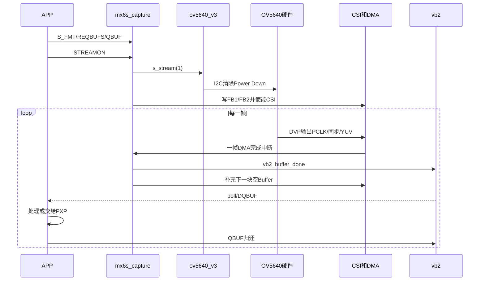

# i.MX6ULL OV5640：V4L2、Media 与 CSI 源码贯通课程

> 适用工程：100ASK i.MX6ULL，Linux 4.9.88，OV5640 DVP 摄像头  
> 核心源码：`mx6s_capture.c` 与 `ov5640_v3.c`  
> 文档目标：不是背函数，而是能够沿着一帧图像的完整链路定位问题。

---

## 0. 这门课程最终要解决什么

学完以后，面对下面的问题，应该能够自己沿源码回答：

1. `/dev/video1` 是谁创建的，为什么不是 OV5640 创建的？
2. OV5640 驱动为什么是 I2C 驱动，又为什么属于 V4L2？
3. `video_device`、`v4l2_device`、`v4l2_subdev`、`media_entity` 分别是什么？
4. 设备树中的 `port`、`endpoint`、`remote-endpoint` 最后被哪段代码使用？
5. `VIDIOC_S_FMT` 为什么会同时影响 CSI Host 和 Sensor？
6. FourCC `YUYV` 与 `MEDIA_BUS_FMT_YUYV8_2X8` 为什么不是同一个概念？
7. `VIDIOC_REQBUFS/QBUF/STREAMON/DQBUF` 如何经过 VB2、CSI、DMA，最终拿到一帧？
8. DVP、MIPI CSI-2 与 i.MX6ULL 的 CSI 控制器分别处于哪一层？
9. 为什么 V2 能出图，V3 反而可能出现 `unknown mbus`、绿条纹、四幅画面？
10. 出现异常时，怎样判断问题属于 Sensor、总线格式、CSI、DMA、Buffer 还是显示转换？

贯穿全文的唯一主线是：

```text
光线
  ↓
OV5640 像素阵列和内部 ISP
  ↓
OV5640 DVP 输出：PCLK + VSYNC + HREF + D[7:0]
  ↓
i.MX6ULL CSI 接收控制器
  ↓
CSI FIFO / DMA
  ↓
VB2 Buffer
  ↓
/dev/video1
  ↓
用户程序 mmap / DQBUF
  ↓
YUV 转 RGB并显示到 framebuffer
```

以后分析任意摄像头问题，都先问一句：

> 当前问题发生在这条链路的哪一段？

---

## 1. 本工程的版本边界

本课程不是泛泛讲最新版 Linux，而是以当前实际源码为准：

```text
Linux：4.9.88
CSI Host：drivers/media/platform/mxc/capture/mx6s_capture.c
Sensor：drivers/media/platform/mxc/capture/ov5640_v3.c
板级 DTS：arch/arm/boot/dts/100ask_imx6ull-14x14.dts
```

当前内核配置为：

```text
CONFIG_MEDIA_CONTROLLER=y
CONFIG_VIDEO_V4L2_SUBDEV_API=y
CONFIG_VIDEO_MXC_CAPTURE=m
CONFIG_VIDEO_MXC_CSI_CAMERA=m
CONFIG_MXC_CAMERA_OV5640_V3=m
```

需要特别注意：`ov5640_v3.c` 是移植、修改过的旧式 NXP/Freescale驱动，并不完全等同于现代主线 Linux Sensor 驱动。分析时必须以实际代码行为为准，不能只凭现代 V4L2 教程推断。

源码入口：

- [mx6s_capture.c](Z:/work/100ask/imx6ull/100ask_imx6ull-sdk/Buildroot_2020.02.x/output/build/linux-origin_master/drivers/media/platform/mxc/capture/mx6s_capture.c)
- [ov5640_v3.c](Z:/work/100ask/imx6ull/100ask_imx6ull-sdk/Buildroot_2020.02.x/output/build/linux-origin_master/drivers/media/platform/mxc/capture/ov5640_v3.c)
- [100ask_imx6ull-14x14.dts](Z:/work/100ask/imx6ull/100ask_imx6ull-sdk/Buildroot_2020.02.x/output/build/linux-origin_master/arch/arm/boot/dts/100ask_imx6ull-14x14.dts)

---

## 2. 先把最容易混淆的名词分层

### 2.1 Sensor 是什么

Sensor 是产生图像的源头。在当前项目里就是 OV5640 芯片。

它完成：

- 光电转换；
- 曝光、增益、白平衡等控制；
- 内部 ISP 处理；
- 缩放到 640×480、320×240 等尺寸；
- 组织 YUYV、UYVY 等字节顺序；
- 通过 DVP 引脚输出像素和同步信号。

Linux 通过 I2C 写 OV5640 寄存器来控制这些行为，但真正的视频数据不走 I2C。

```text
I2C：低速控制通道
DVP：高速图像数据通道
```

### 2.2 CSI 是什么

在 i.MX6ULL 中，CSI 是片内 Camera Sensor Interface 接收控制器。它负责接收外部摄像头的像素时钟、同步和数据，然后利用 FIFO/DMA 写入内存。

当前 `/dev/video1` 显示：

```text
driver   : mx6s-csi
card     : i.MX6S_CSI
bus_info : platform:21c4000.csi
```

这三行已经证明 `/dev/video1` 的直接驱动者是 `mx6s_capture.c`。

### 2.3 DVP 与 MIPI CSI-2

二者都是 Sensor 到 SoC 的视频传输方式，但物理层完全不同：

| 项目 | DVP | MIPI CSI-2 |
|---|---|---|
| 线路 | PCLK、VSYNC、HREF、D0～D7 | Clock Lane、Data Lane |
| 数据方式 | 并行 | 高速差分串行 |
| 当前 OV5640 接法 | 是 | 否 |
| 当前 i.MX6ULL路径 | 直接进入并行 CSI 引脚 | 不参与当前项目 |

用户所说的“PIMI-CSI”应为 **MIPI CSI-2**。

`mx6s_capture.c` 中虽然包含 MIPI 分支，但不代表当前硬件就在使用 MIPI。该驱动被多个 i.MX6 型号复用；是否进入 MIPI 分支由 CSI 节点中的 `fsl,mipi-mode` 决定。当前 DVP 设备树不应该添加这个属性。

对应源码：`mx6s_csi_mode_sel()`，约 1702～1744 行。

### 2.4 V4L2 子系统是什么

V4L2 是 Linux 给用户程序提供的视频设备接口，主要负责：

- `/dev/videoX`；
- 查询能力和格式；
- 设置分辨率、像素格式、帧率；
- 申请和管理 Buffer；
- 开始/停止视频流；
- 取出完成的一帧。

应用程序看到的是 V4L2 ioctl：

```text
VIDIOC_QUERYCAP
VIDIOC_ENUM_FMT
VIDIOC_S_FMT
VIDIOC_REQBUFS
VIDIOC_QUERYBUF
VIDIOC_QBUF
VIDIOC_STREAMON
VIDIOC_DQBUF
```

### 2.5 Media 子系统是什么

复杂摄像头系统可能包含：

```text
Sensor → MIPI接收器 → ISP → Scaler → Capture
```

Media Controller 用以下对象描述这些组件和连接：

- `media_entity`：一个功能模块；
- `media_pad`：模块的输入口或输出口；
- `media_link`：两个 pad 之间的连接；
- `media_pipeline`：一条正在工作的实体链路。

在 `ov5640_v3.c` 中：

```c
sd->entity.function = MEDIA_ENT_F_CAM_SENSOR;
sensor->pads[0].flags = MEDIA_PAD_FL_SOURCE;
media_entity_pads_init(...);
```

这表示 OV5640 被描述成一个 Sensor entity，并拥有一个输出 pad。

但是必须注意本工程的实际情况：

> `mx6s_capture.c` 没有为 CSI Capture 建立对应的 `media_entity` 和 `media_link`，也没有注册完整的 `media_device` graph。

所以当前代码并不是一条完整、现代化、可由 `media-ctl` 配置的 Media Pipeline。它主要使用：

```text
设备树 graph
    + V4L2 async notifier
    + csi_dev->sd 指针
```

把 Sensor 与 CSI Host 连接起来。

因此后文会区分三种“Pipeline”：

1. **硬件 Pipeline**：OV5640 → DVP → CSI → DMA → 内存；
2. **软件调用 Pipeline**：video ioctl → mx6s_capture → v4l2_subdev_call → ov5640_v3；
3. **Media Controller graph**：当前驱动只实现了 Sensor entity 的一部分，并不完整。

### 2.6 VB2 是什么

VB2 全名 videobuf2，是 V4L2 中专门管理视频 Buffer 的框架。

它处理：

- 申请 Buffer；
- mmap/User Pointer；
- Buffer 状态变化；
- 排队与出队；
- STREAMON/STREAMOFF；
- DMA 完成后唤醒用户程序。

`mx6s_capture.c` 是 VB2 Buffer 的实际使用者；OV5640 Sensor 驱动不管理视频帧内存。

---

## 3. 两个驱动怎样分工

| 对象 | `ov5640_v3.c` | `mx6s_capture.c` |
|---|---|---|
| Linux 总线类型 | I2C 驱动 | Platform 驱动 |
| 代表的硬件 | OV5640 Sensor | i.MX6ULL CSI 控制器 |
| 核心对象 | `struct v4l2_subdev` | `struct video_device` |
| 是否创建 `/dev/videoX` | 否 | 是 |
| 是否读写 OV5640 寄存器 | 是 | 否 |
| 是否控制 CSI 寄存器 | 否 | 是 |
| 是否管理 DMA Buffer | 否 | 是，通过 VB2 |
| 是否决定 Sensor 输出模式 | 是 | 通过 subdev 调用请求 Sensor |
| 是否接收中断 | 不接收帧完成中断 | 接收 CSI 帧完成中断 |

最重要的一句话：

> `mx6s_capture.c` 面向用户程序并负责收帧；`ov5640_v3.c` 藏在后面，负责把 Sensor 配置成双方约定的输出状态。

`mx6s_capture.c` 保存了一个关键指针：

```c
struct v4l2_subdev *sd;
```

异步绑定完成后：

```c
csi_dev->sd = subdev;
```

从此 CSI Host 就可以这样调用 Sensor：

```c
v4l2_subdev_call(sd, pad, set_fmt, ...);
v4l2_subdev_call(sd, video, s_stream, 1);
v4l2_subdev_call(sd, core, s_power, 1);
```

这就是两个文件之间最核心的软件连接。

---

## 4. 第一条主线：模块加载和 probe

### 4.1 CSI Host 为什么会 probe

设备树中的 CSI 控制器节点来自 SoC `.dtsi`：

```text
csi@021c4000
compatible = "fsl,imx6ul-csi"
```

`mx6s_capture.c` 尾部的 `platform_driver` 通过 compatible 匹配后进入：

```c
mx6s_csi_probe(struct platform_device *pdev)
```

关键步骤：

1. 分配 `struct mx6s_csi_dev`；
2. 取得 CSI 寄存器地址和 IRQ；
3. 映射寄存器；
4. 取得 CSI 相关时钟；
5. 注册 `struct v4l2_device`；
6. 分配并注册 `struct video_device`；
7. 生成 `/dev/videoX`；
8. 注册 CSI 中断处理函数；
9. 根据设备树 graph 注册异步 Sensor 等待项。

关键源码范围：`mx6s_capture.c:1804～1926`。

注意注册顺序：

```c
video_register_device(...);   // 先生成 /dev/videoX
mx6sx_register_subdevs(...);  // 后等待 Sensor
```

因此：

> `/dev/video1` 存在，只能证明 CSI Capture 驱动注册成功，不能单独证明 OV5640 已经绑定成功。

这正是之前删除 `mclk`/`mclk_source` 后，仍然能看到 `/dev/video1`，但枚举帧尺寸返回 `No such device` 的根本原因。

### 4.2 OV5640 为什么会 probe

设备树中 `&i2c1` 的子节点：

```dts
ov5640@3c {
    compatible = "ovti,ov5640";
    reg = <0x3c>;
    ...
};
```

I2C Core 为它创建 `i2c_client`，再与 `ov5640_i2c_driver` 的 ID 表匹配：

```c
static const struct i2c_device_id ov5640_id[] = {
    { "ov5640", 0 },
    { }
};
```

然后进入：

```c
ov5640_probe(struct i2c_client *client, ...)
```

当前 probe 的关键步骤：

1. 选择 Sensor 节点的默认 pinctrl；
2. 获取 PWDN、RESET GPIO；
3. 获取名为 `csi_mclk` 的 clock；
4. 读取 `mclk`、`mclk_source`、`csi_id`；
5. 判断是否存在 `mipi_csi`；
6. 复位并退出 Power Down；
7. I2C 读取 `0x300A/0x300B`，确认 Chip ID 为 `0x5640`；
8. 调用 `init_device()` 写入初始化、VGA和30fps寄存器；
9. 初始化 `v4l2_subdev`；
10. 初始化 Sensor 的 `media_entity/media_pad`；
11. 调用 `v4l2_async_register_subdev()`。

关键源码范围：`ov5640_v3.c:1391～1534`。

### 4.3 为什么两个驱动没有固定 probe 先后顺序

CSI 控制器和 I2C Sensor 是两个不同设备，模块加载和总线枚举时序可能不同：

```text
情况A：CSI先注册 notifier，OV5640随后注册 subdev
情况B：OV5640先注册 subdev，CSI随后注册 notifier
```

V4L2 Async 框架的作用就是：谁先来都可以，等双方都出现后再匹配。

---

## 5. 第二条主线：设备树 graph 怎样把两者连接起来

设备树连接关系：

```dts
ov5640@3c {
    port {
        ov5640_ep: endpoint {
            remote-endpoint = <&csi1_ep>;
        };
    };
};

&csi {
    port {
        csi1_ep: endpoint {
            remote-endpoint = <&ov5640_ep>;
        };
    };
};
```

这段设备树表达的是拓扑关系，不是视频数据本身。

### 5.1 CSI Host 怎样寻找远端 Sensor

`mx6sx_register_subdevs()`：

```text
遍历 CSI 子节点
  ↓
寻找名字严格等于 port 的节点
  ↓
取得其第一个 endpoint
  ↓
读取 remote-endpoint
  ↓
找到远端 ov5640@3c 的父节点
  ↓
设置 V4L2_ASYNC_MATCH_OF
```

核心代码：

```c
if (of_node_cmp(node->name, "port"))
    continue;

port = of_get_next_child(node, NULL);
rem = of_graph_get_remote_port_parent(port);

csi_dev->asd.match_type = V4L2_ASYNC_MATCH_OF;
csi_dev->asd.match.of.node = rem;
```

关键源码范围：`mx6s_capture.c:1759～1801`。

### 5.2 异步匹配成功后发生什么

回调函数：

```c
subdev_notifier_bound(...)
```

核心代码：

```c
if (csi_dev->asd.match.of.node == subdev->dev->of_node)
    csi_dev->sd = subdev;
```

这里没有比较字符串 `ov5640_ep` 或 `csi1_ep`。DTC 已经把 label 引用转换成 phandle，运行时最终比较的是设备树节点指针。

绑定完成后的关系是：

```text
csi_dev
  ├── video_device → /dev/video1
  └── sd ─────────→ OV5640 v4l2_subdev
```

---

## 6. 第三条主线：格式为什么有两套名字

摄像头链路中至少存在两种格式描述：

### 6.1 内存格式 FourCC

用户态与视频节点之间使用：

```c
V4L2_PIX_FMT_YUYV
```

它说明一帧写进内存后，字节应该怎样排列：

```text
Y0 U0 Y1 V0 Y2 U1 Y3 V1 ...
```

### 6.2 Media Bus 格式

Sensor 与 CSI 之间使用：

```c
MEDIA_BUS_FMT_YUYV8_2X8
```

它不仅表达 Y/U/V 顺序，还表达总线宽度和传输组织。`2X8` 表示一个 YUV422 双像素组包含4字节，通过8位总线分4个 PCLK周期传输。

### 6.3 Host 负责建立二者映射

`mx6s_capture.c` 的 `formats[]`：

```c
{
    .fourcc      = V4L2_PIX_FMT_YUYV,
    .mbus_code   = MEDIA_BUS_FMT_YUYV8_2X8,
    .bpp         = 2,
}
```

因此应用请求 YUYV 时，Host 会向 Sensor 请求对应的 YUYV media-bus code。

关键源码：`mx6s_capture.c:243～277`。

### 6.4 `YUYV-16` 中的 16

它表示平均每个像素16 bit，也就是：

```text
2 bytes/pixel
bytesperline = width × 2
sizeimage    = width × height × 2
```

它不是16位并行数据总线。当前 DVP 仍然是8位并行线，每个 PCLK传输一个字节。

### 6.5 `unknown mbus: 0x2009` 已经可以精确解释

当前内核头文件定义：

```c
MEDIA_BUS_FMT_UYVY8_2X8 = 0x2006
MEDIA_BUS_FMT_YUYV8_2X8 = 0x2008
MEDIA_BUS_FMT_YVYU8_2X8 = 0x2009
```

历史日志：

```text
unknown mbus:0x2009
mx6s-csi: mbus (0x00002009) invalid
```

其含义不是“未知的随机数字”，而是：

> 当时 OV5640 V3 上报了 `YVYU8_2X8`，但 `mx6s_capture.c` 的 `formats[]` 没有 YVYU 项，所以 `format_by_mbus()` 查找失败。

这是软件格式表不一致的直接证据，与 `0x1b088` PAD 电气配置无关。

---

## 7. 第四条主线：应用设置格式时发生了什么

用户调用：

```c
ioctl(fd, VIDIOC_S_FMT, &fmt);
```

进入：

```text
video_ioctl2
  ↓
mx6s_vidioc_s_fmt_vid_cap
  ↓
mx6s_vidioc_try_fmt_vid_cap
  ↓
v4l2_subdev_call(sd, pad, set_fmt, ...)
  ↓
ov5640_set_fmt
  ↓
返回 Host
  ↓
计算 bytesperline / sizeimage
  ↓
mx6s_configure_csi
```

### 7.1 Host 做了什么

`mx6s_vidioc_try_fmt_vid_cap()`：

1. 根据 FourCC 找到 `mx6s_fmt`；
2. 使用 `v4l2_fill_mbus_format()` 转换为总线格式；
3. 调用 Sensor 的 `.set_fmt`；
4. 把 Sensor 返回结果转换回 `v4l2_pix_format`；
5. 计算 `sizeimage` 和 `bytesperline`。

`mx6s_vidioc_s_fmt_vid_cap()`：

1. 保存 Host 当前格式；
2. 保存 width/height/sizeimage；
3. 调用 `mx6s_configure_csi()` 设置 CSI 图像参数。

关键源码：`mx6s_capture.c:1395～1460`。

### 7.2 DVP下为什么 CSI 宽度要乘2

源码：

```c
case V4L2_PIX_FMT_UYVY:
case V4L2_PIX_FMT_YUYV:
    if (csi_dev->csi_mipi_mode)
        width = pix->width;
    else
        width = pix->width * 2;
```

原因：YUV422平均每像素2字节，而DVP是8位总线，每个PCLK只收1字节。640像素一行实际需要接收1280个字节周期，所以并行模式写入 CSI 图像参数的宽度为 `640 × 2`。

这正是理解“8位DVP为什么得到YUYV-16”的关键。

### 7.3 当前 V3 的 `.set_fmt` 存在什么风险

`ov5640_set_fmt()` 当前主要修改 `media-bus code` 和 `sensor->fmt`，但它没有：

- 根据 `mf->width/mf->height` 选择 Sensor mode；
- 写分辨率寄存器；
- 根据 YUYV/UYVY 修改 `0x4300`；
- 更新 `sensor->pix.width/height`。

真正修改 Sensor 分辨率的是另一条旧式路径：

```text
VIDIOC_S_PARM
  ↓
mx6s_vidioc_s_parm
  ↓
ov5640_s_parm
  ↓
ov5640_change_mode
```

并且 `ov5640_s_parm()` 使用 `capturemode` 枚举，而不是直接使用 `S_FMT` 的 width/height。

这会产生一个严重的一致性风险：

```text
Host认为：320×240
Sensor实际仍输出：640×480
```

这类不一致比 PAD 配置更容易产生稳定的重复画面、错行、四幅图等现象。

---

## 8. 第五条主线：打开设备和申请 Buffer

### 8.1 `open("/dev/video1")`

进入 `mx6s_csi_open()`：

1. 设置 VB2 Queue 类型；
2. 支持 `VB2_MMAP | VB2_USERPTR`；
3. 指定 `mx6s_videobuf_ops`；
4. 使用连续 DMA 内存 `vb2_dma_contig_memops`；
5. 初始化 VB2 Queue；
6. 打开运行时电源和总线频率；
7. 调用 Sensor `.s_power(1)`；
8. 初始化 CSI 控制器。

关键源码：`mx6s_capture.c:1153～1191`。

### 8.2 `VIDIOC_REQBUFS`

调用链：

```text
VIDIOC_REQBUFS
  ↓
mx6s_vidioc_reqbufs
  ↓
vb2_reqbufs
  ↓
mx6s_videobuf_setup
```

VB2根据：

```text
sizeimage = width × height × bpp
```

决定每个 Buffer 至少多大。

### 8.3 `VIDIOC_QBUF`

调用链：

```text
VIDIOC_QBUF
  ↓
vb2_qbuf
  ↓
mx6s_videobuf_queue
  ↓
加入 csi_dev->capture 链表
```

此时 Buffer 只是排队等待，还没有完成一帧。

---

## 9. 第六条主线：STREAMON 怎样真正开始收帧

用户调用：

```c
ioctl(fd, VIDIOC_STREAMON, ...);
```

当前实际顺序非常重要：

```text
mx6s_vidioc_streamon
  ↓
vb2_streamon
  ↓
mx6s_start_streaming
  ↓
配置两个 CSI DMA Buffer
  ↓
mx6s_csi_enable
  ↓
返回 mx6s_vidioc_streamon
  ↓
ov5640_s_stream(1)
  ↓
ov5640_start
```

源码明确是：

```c
ret = vb2_streamon(&csi_dev->vb2_vidq, i);
if (!ret)
    v4l2_subdev_call(sd, video, s_stream, 1);
```

也就是：

> 当前 Host 先启动 CSI/VB2，再通知 Sensor 输出视频流。

这不是所有驱动的通用顺序，而是当前 `mx6s_capture.c` 的实际实现。

### 9.1 为什么 V2 和 V3 的表现可能不同

V3实现了：

```c
.s_stream = ov5640_s_stream
```

V2若没有实现 `.s_stream`，`v4l2_subdev_call()` 会按“不支持该回调”处理，不会再次执行 Sensor start/stop 寄存器动作。

V3则会在 STREAMON/STREAMOFF 时真实写 `0x3008`。因此即使设备树完全相同，V2和V3也可能因开流时序、Sensor状态变化而表现不同。

---

## 10. 第七条主线：一帧完成后怎样回到应用程序

### 10.1 CSI使用双 Buffer

`mx6s_start_streaming()` 从 VB2等待队列中取出两个 Buffer：

```text
CSI DMA Buffer 0
CSI DMA Buffer 1
```

CSI硬件交替写入，减少帧与帧之间的空隙。

### 10.2 中断处理

硬件完成一帧后触发 CSI IRQ：

```text
mx6s_csi_irq_handler
  ↓
判断 DMA Buffer 0/1 完成
  ↓
mx6s_csi_frame_done
  ↓
设置 sequence / timestamp
  ↓
vb2_buffer_done(..., VB2_BUF_STATE_DONE)
```

`vb2_buffer_done()` 是关键分界点：

> 在它之前 Buffer 属于驱动和硬件；在它之后 Buffer 可以被用户通过 DQBUF 取走。

### 10.3 用户 `VIDIOC_DQBUF`

```text
VIDIOC_DQBUF
  ↓
mx6s_vidioc_dqbuf
  ↓
vb2_dqbuf
  ↓
返回 index、bytesused、sequence 等信息
```

用户读取的是同一块 mmap 内存，不需要再把整帧从内核复制一次。

处理完成后必须再次 `VIDIOC_QBUF`，把 Buffer 还给驱动循环使用。

---

## 11. 当前源码中已经确认的格式一致性问题

### 11.1 Host支持的格式

`mx6s_capture.c` 当前支持：

```text
UYVY → MEDIA_BUS_FMT_UYVY8_2X8
YUYV → MEDIA_BUS_FMT_YUYV8_2X8
YUV32
SBGGR8
```

### 11.2 V3当前上报的格式

`ov5640_colour_fmts[]` 当前为：

```text
MEDIA_BUS_FMT_YUYV8_2X8
MEDIA_BUS_FMT_UYVY8_2X8
```

但 `probe()` 中DVP默认值仍然写成：

```c
ov5640_data.pix.pixelformat = V4L2_PIX_FMT_YVYU;
```

同时 `ov5640_config[]` 固定写 `0x4300 = 0x30`，`.set_fmt()` 又没有根据用户选择重写 `0x4300`。

因此存在三份可能不一致的“格式真相”：

```text
Sensor寄存器0x4300的真实输出
OV5640 subdev上报的mbus code
CSI Host交给用户的FourCC
```

正确原则是：三者必须表达同一种字节顺序。

### 11.3 `enum_mbus_code()`也有设计风险

当前函数无论是DVP还是MIPI，都直接枚举 `ov5640_colour_fmts[]` 中的全部格式：

```c
code->code = ov5640_colour_fmts[code->index].code;
```

但是 Sensor 初始化寄存器并不会随枚举结果自动改变。所谓“枚举支持”应该意味着驱动真的能通过 `.set_fmt()` 把硬件切到该格式；当前 V3 没有完整做到这一点。

---

## 12. 症状怎样映射到 Pipeline

| 症状 | 优先检查层级 |
|---|---|
| I2C读 `0x300A` 失败 | 供电、PWDN、RESET、I2C、XCLK |
| `/dev/video1`存在但帧尺寸返回 `ENODEV` | Sensor probe/async绑定 |
| `unknown mbus: 0x2009` | Sensor与Host的mbus格式表 |
| STREAMON超时、完全没有帧 | Sensor是否输出、PCLK/VSYNC/HREF、开流顺序 |
| 随机噪点、偶发错位 | pinctrl电气参数、PCLK边沿、线缆信号质量 |
| 稳定绿色/紫色 | YUYV/UYVY/YVYU解释错误，YUV转RGB错误 |
| 稳定分成四幅画面 | Sensor实际尺寸与Host/显示尺寸不一致，stride错误 |
| `bytesused`正确但原始数据异常 | Sensor输出格式、CSI采样、同步极性、数据线映射 |
| 原始YUYV正确但LCD错误 | 用户态转换、framebuffer stride/像素布局 |

这里最重要的方法是：

> 稳定且有规律的错误通常优先查格式、宽高、stride和同步配置；随机且随频率、温度、线缆变化的错误才优先查PAD和信号完整性。

---

## 13. 当前项目建议的源码分析顺序

不要从文件第一行开始顺序阅读。按下面顺序效率最高。

### 第一轮：只建立对象关系

1. `struct ov5640`
2. `struct mx6s_csi_dev`
3. `ov5640_subdev_ops`
4. `mx6s_csi_fops`
5. `mx6s_csi_ioctl_ops`
6. `mx6s_videobuf_ops`

目标：知道每一张“函数指针表”属于谁、由谁调用。

### 第二轮：只看注册过程

1. `mx6s_csi_probe()`
2. `ov5640_probe()`
3. `mx6sx_register_subdevs()`
4. `v4l2_async_register_subdev()`
5. `subdev_notifier_bound()`

目标：解释 `/dev/video1` 和 `csi_dev->sd` 怎样出现。

### 第三轮：只看格式协商

1. `formats[]`
2. `ov5640_colour_fmts[]`
3. `mx6s_vidioc_enum_fmt_vid_cap()`
4. `mx6s_vidioc_try_fmt_vid_cap()`
5. `ov5640_set_fmt()`
6. `mx6s_configure_csi()`

目标：画出 FourCC → mbus code → Sensor寄存器的对应关系。

### 第四轮：只看 Buffer 和开流

1. `mx6s_csi_open()`
2. `mx6s_videobuf_setup/prepare/queue()`
3. `mx6s_vidioc_streamon()`
4. `mx6s_start_streaming()`
5. `ov5640_s_stream()`
6. `mx6s_csi_irq_handler()`
7. `mx6s_csi_frame_done()`

目标：解释一块 Buffer 的完整生命周期。

### 第五轮：结合当前故障

1. 读取 Sensor `0x4300` 的实际值；
2. 打印 `enum_mbus_code/set_fmt/get_fmt` 的 code；
3. 打印 Sensor实际 width/height；
4. 打印 CSI `pix.width/height/bytesperline/sizeimage`；
5. 对照保存的 raw 文件验证字节顺序和行周期。

---

## 14. 第一组源码练习

### 练习1：证明 `/dev/video1` 由谁创建

在 `mx6s_csi_probe()` 中找到：

```c
video_register_device(csi_dev->vdev, VFL_TYPE_GRABBER, -1);
```

再找到：

```c
vdev->name = "mx6s-csi";
vdev->fops = &mx6s_csi_fops;
vdev->ioctl_ops = &mx6s_csi_ioctl_ops;
```

能够用自己的话解释：为什么用户对 `/dev/video1` 调用 ioctl，最终进入 `mx6s_capture.c`。

### 练习2：证明 OV5640 不直接创建 `/dev/video1`

检查 `ov5640_probe()`：它调用的是：

```c
v4l2_i2c_subdev_init(...);
v4l2_async_register_subdev(...);
```

而不是 `video_register_device()`。

因此它注册的是 subdev，不是 capture video node。

### 练习3：跟踪 `VIDIOC_ENUM_FMT`

按顺序标出：

```text
mx6s_vidioc_enum_fmt_vid_cap
v4l2_subdev_call(...enum_mbus_code...)
ov5640_enum_code
format_by_mbus
```

回答：如果 Sensor 返回 `0x2009`，Host为什么报 invalid？

### 练习4：跟踪 `VIDIOC_S_FMT`

回答下面四个问题：

1. FourCC在哪里转换成mbus code？
2. Sensor的 `.set_fmt()` 有没有真正写 `0x4300`？
3. Sensor的 `.set_fmt()` 有没有根据 width/height切换分辨率？
4. Host在哪里计算 `bytesperline` 和 `sizeimage`？

### 练习5：跟踪一块 Buffer

给一块 Buffer 画出状态变化：

```text
用户申请
  → QBUF
  → capture链表
  → active_bufs
  → CSI DMA写入
  → IRQ
  → VB2_BUF_STATE_DONE
  → DQBUF
  → 用户处理
  → 再次QBUF
```

---

## 15. 后续课程安排

### 第1讲：对象和框架

- `video_device`
- `v4l2_device`
- `v4l2_subdev`
- `media_entity/media_pad`
- `vb2_queue`

### 第2讲：probe与设备树绑定

- Platform Bus与I2C Bus
- compatible/reg
- port/endpoint/remote-endpoint
- V4L2 async notifier

### 第3讲：格式协商

- FourCC
- media-bus code
- YUYV/UYVY/YVYU
- width/height/bytesperline/sizeimage
- Sensor mode与CSI mode的一致性

### 第4讲：开流与Buffer

- REQBUFS/QUERYBUF/QBUF
- mmap
- VB2
- STREAMON
- 双Buffer、DMA、中断、DQBUF

### 第5讲：DVP与MIPI CSI-2

- 两种物理链路
- `csi_mipi_mode`
- `mipi_csi`
- 为什么当前项目必须走DVP分支

### 第6讲：结合实际故障调试

- `unknown mbus:0x2009`
- 四幅画面
- 绿色条纹
- V2/V3差异
- 如何增加最少量日志定位第一处不一致

---

## 16. 一页复习卡

```text
OV5640是什么？
  Sensor，同时是I2C设备和V4L2 subdev。

mx6s_capture是什么？
  i.MX6ULL CSI Host/Capture驱动，创建/dev/videoX并管理DMA Buffer。

两者怎么认识？
  设备树graph + V4L2 async notifier，最终得到csi_dev->sd。

谁接收用户ioctl？
  mx6s_capture的video_device。

谁写OV5640寄存器？
  ov5640_v3 subdev驱动。

谁管理帧Buffer？
  mx6s_capture + VB2。

FourCC是什么？
  内存里的像素格式。

mbus code是什么？
  Sensor到CSI之间的总线传输格式。

当前是不是MIPI？
  不是，是8位DVP并行输入。

Pipeline最重要的一致性是什么？
  Sensor实际输出、subdev上报、CSI配置、用户内存解释必须一致。
```

---

## 17. 当前阶段结论

目前已经能确认：

1. `mx6s_capture.c` 确实是 `/dev/video1` 对应的 CSI Capture 驱动；
2. `ov5640_v3.c` 是挂在它后面的 Sensor subdev；
3. 两者通过设备树 graph 和 V4L2 async 绑定；
4. 当前链路是 DVP，不是 MIPI CSI-2；
5. `0x2009` 精确对应 YVYU media-bus code，历史报错来自 Host格式表没有该项；
6. V3 的格式枚举、默认 pixelformat、`0x4300` 和 `.set_fmt()` 行为之间存在需要继续核查的一致性问题；
7. V3 的 `.set_fmt()` 没有直接切换Sensor分辨率，而旧驱动把模式切换放在 `.s_parm()`，这与普通应用只调用 `S_FMT` 的习惯存在冲突风险；
8. 下一步源码调试应先证明“Sensor真实输出格式和尺寸”，再调整CSI或显示程序。

这份文档后续应随着每一讲继续补充真实调用栈、寄存器验证和实验结果，而不是一次看完就结束。

---

## 18. 实测闭环：花屏最终由 `0x4740` 引起（2026-08-10）

OV5640 V3 的 DVP 配置原来为 `{0x4740, 0x23, 0, 0}`，实测改为 `{0x4740, 0x21, 0, 0}` 后显示恢复正常。当前只修改 `ov5640_config[]` 的 DVP 分支，MIPI 配置表仍为 `0x23`。

这说明问题属于 **Sensor DVP 输出时序与 CSI 输入采样之间的接口契约**。即使 I2C、Chip ID、视频节点、Buffer长度和 DMA 都正常，只要同步极性或采样条件不一致，仍然会花屏。

最终归类：不是 `0x1b088` PAD值问题，也不是应用YUV转RGB问题。
---

## 19. DVP在哪里工作：贯通`mx6s_capture.c`

### 19.1 DVP不是一个C函数

DVP是一组并行图像信号：

```text
PCLK       像素采样时钟
VSYNC      帧边界
HREF/HSYNC 行有效或行同步
D0～D7     每个PCLK传输的8位数据
```

它工作在两个硬件端之间：

```text
OV5640内部DVP发送器
  ↓ PCB走线
i.MX6ULL CSI并行接收器
```

`ov5640_v3.c`通过I²C配置发送端，`mx6s_capture.c`通过CSI寄存器配置接收端。图像字节不经过驱动函数，而是直接经过DVP引脚和硬件。

```text
控制平面：
APP/V4L2 → mx6s_capture → OV5640 Subdev → I²C寄存器

数据平面：
OV5640像素阵列 → ISP → DVP → CSI → RxFIFO → DMA → DDR Buffer
```

### 19.2 DVP链路的四层配置

#### 第一层：原理图

```text
OV5640 PCLK  → CSI_PIXCLK
OV5640 VSYNC → CSI_VSYNC
OV5640 HREF  → CSI_HSYNC
OV5640 D0～D7 → 八根CSI_DATA引脚
```

软件不能修复接反的数据线或错误电平。

#### 第二层：pinctrl

当前`pinctrl_csi1`把SoC PAD切换成CSI功能：

```dts
MX6UL_PAD_CSI_PIXCLK__CSI_PIXCLK  0x1b088
MX6UL_PAD_CSI_VSYNC__CSI_VSYNC    0x1b088
MX6UL_PAD_CSI_HSYNC__CSI_HSYNC    0x1b088
MX6UL_PAD_CSI_DATA00__CSI_DATA02  0x1b088
...
MX6UL_PAD_CSI_DATA07__CSI_DATA09  0x1b088
```

宏前半部分是物理PAD，后半部分是选择的CSI复用功能，`0x1b088`是PAD电气属性。pinmux错误时，外部信号即使到达芯片焊球，也进不了CSI控制器。

#### 第三层：OV5640发送端

`ov5640_v3.c`通过I²C配置：

```c
{0x4300, 0x30, 0, 0}, // YUV422 YUYV
{0x501f, 0x00, 0, 0}, // ISP输出选择
{0x300e, 0x58, 0, 0}, // DVP模式
{0x4740, 0x21, 0, 0}, // DVP同步极性
```

模式表还配置PLL、宽高、HTS/VTS、裁剪和帧率。最后写：

```c
ov5640_write_reg(0x3008, 0x02);
```

解除Power Down，OV5640内部硬件持续驱动DVP引脚。

#### 第四层：i.MX6ULL CSI接收端

`mx6s_capture.c`通过`csi_read()`、`csi_write()`访问`0x021c4000`处的CSI寄存器。

`csi_init_interface()`设置采样边沿、门控时钟和FIFO控制；`mx6s_configure_csi()`设置图像尺寸。8位DVP上传输YUYV时：

```c
width = pix->width * 2;
csi_set_imagpara(csi_dev, width, pix->height);
```

因为YUYV平均每像素2字节，而8位DVP每个PCLK传1字节。

随后：

```text
csi_dmareq_rff_enable() → 使能RxFIFO到DMA请求
csi_enable_int()        → 使能SOF和FB1/FB2完成中断
csi_enable()            → 设置BIT_CSI_ENABLE
```

### 19.3 endpoint不是DVP数据通道

当前两端通过：

```dts
remote-endpoint = <&ov5640_ep>;
remote-endpoint = <&csi1_ep>;
```

表达软件拓扑：“这个OV5640是这个CSI的数据源”。V4L2 async用它完成Host和Sensor Subdev绑定。

endpoint不会自动配置：

- PAD复用。
- OV5640寄存器。
- CSI寄存器。
- DMA Buffer。
- PCB连线。

当前endpoint没有填写DVP极性属性，`mx6s_capture.c`也没有调用`v4l2_of_parse_endpoint()`解析极性。因此Sensor侧主要由`ov5640_v3.c`硬编码，CSI侧主要由`csi_init_interface()`硬编码，两端必须手工保持一致。

`csi_init_interface()`附近仍有一条提到`0x4740=0x23`的旧注释，但实测DVP已经改为`0x21`。注释已经过期，不能当成当前事实。

### 19.4 配置什么时候生效

```text
设备probe
  → pinctrl应用pinctrl_csi1，PAD接入CSI

OV5640 probe/模式设置
  → I²C下载寄存器，DVP发送格式和时序生效

open(/dev/videoX)
  → 打开CSI时钟
  → mx6s_csi_init()初始化CSI

VIDIOC_S_FMT
  → 确定宽高、FourCC和media-bus格式

VIDIOC_STREAMON
  → ov5640_s_stream(1)，Sensor输出
  → vb2_streamon()
  → mx6s_start_streaming()
  → 写FB1/FB2 DMA地址
  → 配置并使能CSI、DMA和中断
```

正确图像要求以下条件同时成立：

1. PAD已复用为CSI。
2. OV5640正在输出正确DVP格式和极性。
3. CSI按匹配条件采样。
4. 至少两块Buffer已经QBUF。
5. CSI、DMA请求和中断已经使能。

### 19.5 `mx6s_capture.c`到底做什么

一句话：

> 它是i.MX6ULL CSI Host/Capture驱动，把外部Sensor的DVP字节流接收进DDR Buffer，并包装成APP可使用的V4L2视频节点。

它不负责感光、生成YUV、OV5640内部ISP、YUV转RGB和LCD显示。

#### probe阶段

`mx6s_csi_probe()`：

```text
取得CSI寄存器资源0x021c4000
取得GIC SPI 7中断
ioremap得到regbase
获取CSI相关时钟
初始化capture/active/discard链表
注册V4L2 device和video_device
创建/dev/videoX
申请mx6s_csi_irq_handler
注册async notifier寻找Sensor
```

`reg`、IRQ和clock来自`imx6ull.dtsi`。板级`&csi { status = "okay"; }`负责启用节点。

#### Sensor绑定阶段

设备树graph让`mx6sx_register_subdevs()`注册的async notifier找到OV5640。绑定后：

```text
mx6s_capture Host
  ↔ V4L2 Subdev调用
ov5640_v3 Sensor
```

Host于是可以调用Sensor的格式、帧率和`s_stream()`。

#### APP接口阶段

`mx6s_csi_ioctl_ops`实现：

```text
ENUM_FMT/S_FMT
REQBUFS/QUERYBUF/QBUF/DQBUF
STREAMON/STREAMOFF
```

`video_register_device()`创建的`/dev/video1`来自`mx6s_capture.c`，不是OV5640驱动。

#### Buffer阶段

```text
capture      已QBUF、等待硬件使用的空Buffer
active_bufs  FB1/FB2当前正在写的Buffer
vb2 done     已完成、等待APP DQBUF的Buffer
discard      APP太慢时接收并丢弃帧
```

`mx6s_start_streaming()`至少取两块Buffer：

```text
第1块DMA地址 → CSI_CSIDMASA_FB1
第2块DMA地址 → CSI_CSIDMASA_FB2
```

#### 连续数据阶段

真正的数据搬运由硬件完成：

```text
OV5640 DVP输出
  → CSI引脚采样
  → RxFIFO
  → DMA写FB1
  → 自动切换FB2
```

CPU不逐字节读取DVP。

#### 每帧中断阶段

```text
mx6s_csi_irq_handler()
  → 判断FB1还是FB2完成
  → mx6s_csi_frame_done()
  → 设置timestamp和sequence
  → vb2_buffer_done()
  → 从capture取下一块空Buffer
  → 更新刚空出的FB1或FB2地址
```

中断只处理“一帧完成后的Buffer交接”，不是靠中断采集每个像素。

#### 停止阶段

`mx6s_stop_streaming()`关闭CSI DMA、中断和控制器，归还未完成Buffer并释放discard Buffer；随后调用`ov5640_s_stream(0)`停止Sensor。

### 19.6 完整数据流



### 19.7 源码阅读顺序

```text
mx6s_csi_dt_ids
  → mx6s_csi_probe
  → mx6sx_register_subdevs
  → subdev_notifier_bound
  → mx6s_csi_open
  → mx6s_csi_ioctl_ops
  → mx6s_vidioc_s_fmt_vid_cap
  → mx6s_vidioc_reqbufs/qbuf
  → mx6s_vidioc_streamon
  → mx6s_start_streaming
  → mx6s_configure_csi
  → mx6s_csi_irq_handler
  → mx6s_csi_frame_done
  → mx6s_vidioc_dqbuf
  → mx6s_vidioc_streamoff
```

阅读每个函数只问四个问题：

1. 它属于配置、Buffer还是完成路径？
2. 它修改软件对象、CSI寄存器还是Sensor寄存器？
3. 调用者是APP、V4L2/vb2还是硬件中断？
4. 执行后Buffer所有权属于谁？

### 19.8 一页结论

```text
DVP在哪里？
  OV5640发送器、PCB引脚、i.MX6ULL CSI接收器之间。

DVP怎样配置？
  pinctrl配置PAD，ov5640_v3配置发送端，mx6s_capture配置接收端。

endpoint做什么？
  描述软件拓扑和异步绑定，不搬运像素。

mx6s_capture做什么？
  创建video节点、绑定Sensor、实现ioctl、管理vb2 Buffer、
  配置CSI/DMA、处理中断并把帧交给APP。

数据经过CPU吗？
  不逐字节经过。OV5640硬件 → DVP → CSI硬件 → DMA → DDR。
```
